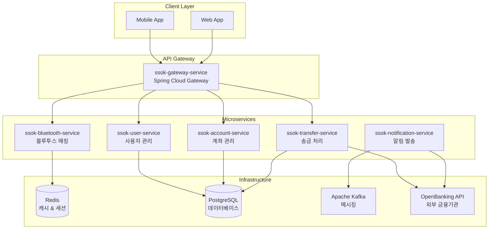

<div align="center">
    
    </a>
    <h3>"블루투스 기반 간편 송금 서비스 SSOK"</h3> 
</div>

<br>

---

<br>

## 📋 개요

> 블루투스 기반 송금 기능을 제공하는 금융 서비스 **SSOK**의 백엔드 저장소입니다.

**SSOK**은 마이크로서비스 아키텍처(MSA)로 설계된 현대적인 금융 서비스 플랫폼으로,  
핀번호 기반 인증과 블루투스를 활용한 혁신적인 근거리 송금 서비스를 제공합니다.

### 🎯 핵심 기능
- **핀번호 기반 인증**: 간편하고 안전한 사용자 인증/인가
- **블루투스 근거리 송금**: 주변 사용자와의 직관적인 송금 서비스
- **실시간 알림**: FCM 푸시 알림 및 SMS 발송
- **오픈뱅킹 연동**: 외부 금융기관([OpenBanking](https://github.com/Team-SSOK/ssok-openbanking))과의 실시간 API 연동
- **통합 계좌 관리**: 다중 은행 계좌 통합 관리

### 🏗️ 아키텍처

SSOK은 **마이크로서비스 아키텍처**로 설계되어 각 도메인별로 독립적인 서비스로 구성되어 있습니다.



## 🛠️ 기술 스택

### Backend Framework
- **Spring Boot 3.4.4**: 마이크로서비스 프레임워크
- **Spring Cloud 2024.0.0**: 마이크로서비스 인프라
- **Spring Security**: 인증/인가 처리
- **Spring Data JPA**: 데이터 액세스 레이어

### Communication
- **Spring Cloud Gateway**: API 게이트웨이
- **OpenFeign**: 서비스 간 HTTP 통신
- **gRPC**: 고성능 내부 서비스 통신
- **Apache Kafka**: 비동기 메시징

### Database & Cache
- **PostgreSQL**: 메인 데이터베이스
- **Redis**: 캐시 및 세션 스토어
- **H2**: 테스트 데이터베이스

### DevOps & Monitoring
- **Docker**: 컨테이너화
- **Kubernetes**: 오케스트레이션
- **Jenkins**: CI/CD 파이프라인
- **Micrometer + Prometheus**: 메트릭 수집
- **Actuator**: 헬스 체크 및 모니터링

## 📂 프로젝트 구조

```
ssok-backend/
├── ssok-common/                    # 공통 라이브러리
├── ssok-gateway-service/           # API 게이트웨이
├── ssok-user-service/              # 사용자 관리 서비스
├── ssok-account-service/           # 계좌 관리 서비스
├── ssok-transfer-service/          # 송금 처리 서비스
├── ssok-bluetooth-service/         # 블루투스 매칭 서비스
├── ssok-notification-service/      # 알림 발송 서비스
├── docker-compose.yml             # 로컬 개발 환경
├── Jenkinsfile                    # CI/CD 파이프라인
└── gradle/                        # Gradle 빌드 설정
```

## 🔗 서비스별 상세 문서

각 마이크로서비스의 상세한 API 명세, 설정 방법, 실행 가이드는 개별 README 문서를 참고하세요.

### 📊 Core Services
| 서비스 | 설명 | 문서 링크 |
|--------|------|-----------|
| **Gateway Service** | API 라우팅, 인증 필터, CORS 처리 | [📖 상세 문서](./ssok-gateway-service/ssok_gateway_service_readme.md) |
| **User Service** | 사용자 관리, 인증/인가, 프로필 관리 | [📖 상세 문서](./ssok-user-service/ssok_user_service_readme.md) |
| **Account Service** | 계좌 관리, OpenBanking 연동 | [📖 상세 문서](./ssok-account-service/ssok_account_service_readme.md) |
| **Transfer Service** | 송금 처리, 거래 내역 관리 | [📖 상세 문서](./ssok-transfer-service/ssok_transfer_service_readme.md) |

### 🔧 Supporting Services
| 서비스 | 설명 | 문서 링크 |
|--------|------|-----------|
| **Bluetooth Service** | 블루투스 매칭, 근거리 송금 | [📖 상세 문서](./ssok-bluetooth-service/ssok_bluetooth_service_readme.md) |
| **Notification Service** | FCM 푸시 알림, SMS 발송 | [📖 상세 문서](./ssok-notification-service/ssok_notification_service_readme.md) |

### 📚 Common Libraries
| 모듈 | 설명 | 문서 링크 |
|------|------|-----------|
| **Common** | 공통 예외, 응답, 유틸리티, gRPC Proto | [📖 상세 문서](./ssok-common/ssok_common_readme.md) |

## 🚀 빠른 시작

### 1. 사전 요구사항
- **Java 17** 이상
- **Docker & Docker Compose**
- **Gradle 8.x**

### 2. 로컬 개발 환경 설정

```bash
# 저장소 클론
git clone https://github.com/Team-SSOK/ssok-backend.git
cd ssok-backend

# 인프라 서비스 실행 (PostgreSQL, Redis, Kafka)
docker-compose up -d postgres redis kafka

# 전체 서비스 빌드
./gradlew build

# 개별 서비스 실행 (예: User Service)
./gradlew :ssok-user-service:bootRun
```

### 3. Docker Compose 실행

```bash
# 전체 서비스 실행
docker-compose up -d

# 특정 서비스만 실행
docker-compose up -d ssok-gateway-service ssok-user-service

# 로그 확인
docker-compose logs -f ssok-user-service
```

### 4. 개별 서비스 Docker 빌드

```bash
# 특정 서비스 빌드 (예: Account Service)
docker build -f ssok-account-service/Dockerfile -t ssok-account-service:latest .

# 이미지 실행
docker run -p 8080:8080 ssok-account-service:latest
```

## 📊 API 문서

### Swagger UI
각 서비스는 개발 환경에서 Swagger UI를 제공합니다:

- **Gateway**: http://localhost:8080/swagger-ui.html
- **User Service**: http://localhost:8081/swagger-ui.html
- **Account Service**: http://localhost:8082/swagger-ui.html
- **Transfer Service**: http://localhost:8083/swagger-ui.html
- **Bluetooth Service**: http://localhost:8084/swagger-ui.html
- **Notification Service**: http://localhost:8085/swagger-ui.html

### 주요 API 엔드포인트

```bash
# 사용자 인증
POST /api/users/login

# 계좌 목록 조회
GET /api/accounts

# 송금 실행
POST /api/transfers

# 블루투스 매칭
POST /api/bluetooth/match

# 거래 내역 조회
GET /api/transfers/history
```

## 🔧 환경 설정

### 환경별 프로파일
```yaml
# application.yml
spring:
  profiles:
    active: ${SPRING_PROFILES_ACTIVE:local}

---
# Local 환경
spring:
  config:
    activate:
      on-profile: local
  datasource:
    url: jdbc:postgresql://localhost:5432/ssok_db

---
# Development 환경
spring:
  config:
    activate:
      on-profile: dev
  datasource:
    url: jdbc:postgresql://dev-db:5432/ssok_db

---
# Production 환경
spring:
  config:
    activate:
      on-profile: prod
  datasource:
    url: jdbc:postgresql://prod-db:5432/ssok_db
```

### 환경 변수
주요 환경 변수는 각 서비스의 README 문서에서 확인할 수 있습니다.

## 🔄 CI/CD

### Jenkins 파이프라인
develop 브랜치에 push 또는 merge가 발생하면 Jenkins CI/CD 파이프라인이 자동으로 실행됩니다.

```groovy
// Jenkinsfile 주요 단계
pipeline {
    stages {
        stage('Build') { ... }
        stage('Test') { ... }
        stage('Docker Build') { ... }
        stage('Deploy') { ... }
    }
}
```

**특징:**
- **변경 감지**: 변경된 서비스만 빌드 및 배포
- **병렬 처리**: 독립적인 서비스 동시 빌드
- **롤백 지원**: 배포 실패 시 이전 버전으로 자동 롤백

### 배포 전략
- **Blue-Green 배포**: 무중단 배포
- **Canary 배포**: 점진적 트래픽 전환
- **롤링 업데이트**: Kubernetes 기반 점진적 업데이트

## 🔍 모니터링

### Health Check
```bash
# 전체 서비스 상태 확인
curl http://localhost:8080/actuator/health

# 개별 서비스 상태 확인
curl http://localhost:8081/actuator/health  # User Service
curl http://localhost:8082/actuator/health  # Account Service
```

### 메트릭 수집
- **Prometheus**: 메트릭 수집 및 저장
- **Grafana**: 메트릭 시각화 및 대시보드
- **Micrometer**: 애플리케이션 메트릭 생성

## 🧪 테스트

### 전체 테스트 실행
```bash
# 모든 서비스 테스트
./gradlew test

# 특정 서비스 테스트
./gradlew :ssok-user-service:test

# 통합 테스트
./gradlew integrationTest
```

### 테스트 커버리지
```bash
# 커버리지 리포트 생성
./gradlew jacocoTestReport

# 커버리지 확인
open build/reports/jacoco/test/html/index.html
```

## 🔐 보안

### 인증/인가
- **JWT Token**: Stateless 인증
- **PIN Code**: 추가 보안 계층
- **CORS**: Gateway에서 정책 관리

### 데이터 보호
- **개인정보 마스킹**: 이름, 전화번호 등
- **암호화**: 민감 정보 암호화 저장
- **HTTPS**: 전송 구간 암호화

## 📚 참고 자료

### 관련 저장소
- **[ssok-deploy](https://github.com/Team-SSOK/ssok-deploy)**: Kubernetes 배포 설정
- **[ssok-openbanking](https://github.com/Team-SSOK/ssok-openbanking)**: 외부 금융기관 시뮬레이터
- **[ssok-frontend](https://github.com/Team-SSOK/ssok-frontend)**: 모바일 애플리케이션

### 문서
- **API 명세서**: 각 서비스별 README 참조
- **배포 가이드**: ssok-deploy 저장소 참조
- **아키텍처 문서**: 프로젝트 Wiki 참조

## 🤝 기여하기

1. **Fork** 저장소
2. **Feature Branch** 생성 (`git checkout -b feature/amazing-feature`)
3. **Commit** 변경사항 (`git commit -m 'Add some amazing feature'`)
4. **Push** 브랜치 (`git push origin feature/amazing-feature`)
5. **Pull Request** 생성

### 개발 가이드라인
- **코드 스타일**: Google Java Style Guide 준수
- **커밋 메시지**: Conventional Commits 형식 사용
- **테스트**: 새로운 기능에 대한 테스트 코드 필수
- **문서**: API 변경 시 README 업데이트 필수

## 📞 문의

- **팀**: SSOK Backend Team
- **이슈 등록**: [GitHub Issues](https://github.com/Team-SSOK/ssok-backend/issues)
- **프로젝트 위키**: [GitHub Wiki](https://github.com/Team-SSOK/ssok-backend/wiki)
- **이메일**: ssok-backend@example.com

---

<div align="center">
    <sub>Built with ❤️ by SSOK Backend Team</sub>
</div>
