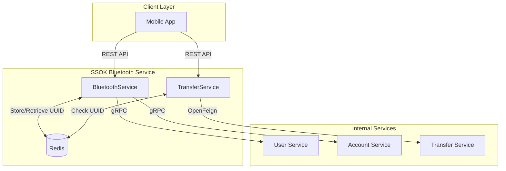

# SSOK Bluetooth Service

SSOK 시스템의 블루투스 기반 사용자 매칭 및 근거리 송금 서비스입니다. Redis를 활용한 실시간 UUID 매칭과 gRPC/OpenFeign을 통한 서비스 간 통신을 담당합니다.

## 🎯 서비스 개요

### 핵심 기능
- **블루투스 UUID 등록/관리**: Redis 기반 실시간 UUID 저장 및 TTL 관리
- **근거리 사용자 매칭**: 스캔된 UUID 목록으로 주변 사용자 검색
- **블루투스 송금**: UUID 기반 수신자 식별 및 송금 처리
- **개인정보 보호**: 사용자명 마스킹, 전화번호 뒷자리만 노출

### 아키텍처 특징
- **Redis 기반 매칭**: 고성능 UUID-사용자 매핑
- **하이브리드 통신**: gRPC(내부 서비스) + OpenFeign(송금 서비스)
- **TTL 관리**: 자동 UUID 만료로 개인정보 보호
- **예외 처리**: 통합 예외 처리 및 gRPC 에러 변환

## 📋 API 명세

### 1. 블루투스 UUID 등록
**POST** `/api/bluetooth/uuid`

```bash
curl -X POST http://localhost:8080/api/bluetooth/uuid \
  -H "Content-Type: application/json" \
  -H "X-User-Id: 1" \
  -d '{
    "bluetoothUUID": "123e4567-e89b-12d3-a456-426614174000"
  }'
```

**응답**
```json
{
  "isSuccess": true,
  "code": 2400,
  "message": "Bluetooth UUID가 정상적으로 등록되었습니다."
}
```

### 2. 주변 사용자 매칭
**POST** `/api/bluetooth/match`

```bash
curl -X POST http://localhost:8080/api/bluetooth/match \
  -H "Content-Type: application/json" \
  -H "X-User-Id: 1" \
  -d '{
    "bluetoothUUIDs": [
      "123e4567-e89b-12d3-a456-426614174000",
      "987fcdeb-51a2-43d1-9c4e-123456789abc"
    ]
  }'
```

**응답**
```json
{
  "isSuccess": true,
  "code": 2400,
  "message": "Bluetooth UUID에 대한 유저가 조회되었습니다.",
  "result": {
    "users": [
      {
        "uuid": "123e4567-e89b-12d3-a456-426614174000",
        "username": "김*수",
        "phoneSuffix": "1234",
        "profileImage": "https://example.com/profile.jpg"
      }
    ],
    "primaryAccount": {
      "accountId": 1,
      "accountNumber": "1002-123-456789",
      "bankCode": 4,
      "balance": 1000000
    }
  }
}
```

### 3. 블루투스 송금
**POST** `/api/bluetooth/transfers`

```bash
curl -X POST http://localhost:8080/api/bluetooth/transfers \
  -H "Content-Type: application/json" \
  -H "X-User-Id: 1" \
  -d '{
    "recvUuid": "123e4567-e89b-12d3-a456-426614174000",
    "sendAccountId": 1,
    "sendBankCode": 4,
    "sendName": "김송금",
    "amount": 10000
  }'
```

**응답**
```json
{
  "isSuccess": true,
  "code": 2400,
  "message": "블루투스 송금이 성공적으로 완료되었습니다.",
  "result": {
    "sendAccountId": 1,
    "recvName": "김*수",
    "amount": 10000,
    "transferDateTime": "2024-01-15T10:30:00"
  }
}
```

## 🏗️ 아키텍처

### 서비스 구조
```
ssok-bluetooth-service/
├── controller/           # REST API 엔드포인트
│   ├── BluetoothController.java
│   └── TransferController.java
├── service/             # 비즈니스 로직
│   ├── BluetoothService.java
│   ├── TransferService.java
│   └── impl/
├── client/              # 외부 서비스 통신
│   ├── TransferServiceClient.java (OpenFeign)
│   └── dto/
├── grpc/client/         # gRPC 클라이언트
│   ├── UserServiceClient.java
│   └── AccountServiceClient.java
├── dto/                 # 데이터 전송 객체
│   ├── request/
│   └── response/
├── config/              # 설정
│   ├── RedisConfig.java
│   ├── GrpcClientConfig.java
│   └── SwaggerConfig.java
└── exception/           # 예외 처리
    ├── BluetoothException.java
    ├── BluetoothResponseStatus.java
    └── BluetoothExceptionHandler.java
```

### 통신 구조


### Redis 데이터 구조
```
# UUID → User ID 매핑
uuid:{bluetoothUUID} → userId (TTL: 설정값)

# User ID → UUID 매핑 (역방향 조회용)
user:{userId} → bluetoothUUID (TTL: 설정값)
```

### gRPC 통신
```protobuf
// User Service 호출
service UserService {
  rpc GetUserInfo(UserIdRequest) returns (UserInfoResponse);
}

// Account Service 호출
service AccountService {
  rpc GetPrimaryAccountBalance(UserIdRequest) returns (PrimaryAccountBalanceResponse);
}
```

## 🛠️ 기술 스택

### 핵심 기술
- **Spring Boot 3.4.4**: 웹 프레임워크
- **Spring Data Redis**: Redis 데이터 액세스
- **Spring Cloud OpenFeign**: HTTP 클라이언트
- **gRPC**: 고성능 내부 서비스 통신
- **Redis**: UUID 매칭 데이터 저장소

### 의존성
```gradle
dependencies {
    implementation project(':ssok-common')
    implementation 'org.springframework.boot:spring-boot-starter-data-jpa'
    implementation 'org.springframework.boot:spring-boot-starter-web'
    implementation 'org.springframework.cloud:spring-cloud-starter-openfeign'
    implementation 'org.springframework.boot:spring-boot-starter-data-redis'
    implementation 'io.grpc:grpc-stub'
    implementation 'io.grpc:grpc-protobuf'
}
```

## 🚀 실행 방법

### 환경 변수
```yaml
spring:
  data:
    redis:
      host: ${REDIS_HOST:localhost}
      port: ${REDIS_PORT:6379}

bluetooth:
  uuid-ttl-seconds: ${BLUETOOTH_UUID_TTL:3600}  # 1시간

external:
  transfer-service:
    url: ${TRANSFER_SERVICE_URL:http://localhost:8084}
  user-service:
    grpc:
      host: ${USER_SERVICE_GRPC_HOST:localhost}
      port: ${USER_SERVICE_GRPC_PORT:9090}
  account-service:
    grpc:
      host: ${ACCOUNT_SERVICE_GRPC_HOST:localhost}
      port: ${ACCOUNT_SERVICE_GRPC_PORT:9091}
```

### Docker 실행
```bash
# Docker 이미지 빌드
docker build -t ssok-bluetooth-service .

# Docker 컨테이너 실행
docker run -d \
  --name ssok-bluetooth-service \
  -p 8080:8080 \
  -e REDIS_HOST=redis \
  -e TRANSFER_SERVICE_URL=http://ssok-transfer-service:8084 \
  ssok-bluetooth-service
```

### 로컬 개발 실행
```bash
# Redis 실행 (Docker)
docker run -d --name redis -p 6379:6379 redis:latest

# 애플리케이션 실행
./gradlew :ssok-bluetooth-service:bootRun
```

## 🔧 설정

### Redis 설정
```java
@Configuration
public class RedisConfig {
    @Bean
    public RedisConnectionFactory redisConnectionFactory() {
        return new LettuceConnectionFactory(host, port);
    }
    
    @Bean
    public RedisTemplate<String, String> redisTemplate() {
        RedisTemplate<String, String> template = new RedisTemplate<>();
        template.setConnectionFactory(redisConnectionFactory());
        template.setKeySerializer(new StringRedisSerializer());
        template.setValueSerializer(new StringRedisSerializer());
        return template;
    }
}
```

### gRPC 클라이언트 설정
```java
@Configuration
public class GrpcClientConfig {
    @Bean
    public UserServiceBlockingStub userServiceBlockingStub() {
        ManagedChannel channel = ManagedChannelBuilder
            .forAddress(userServiceHost, userServicePort)
            .usePlaintext()
            .build();
        return UserServiceGrpc.newBlockingStub(channel);
    }
}
```

## 🔍 모니터링

### 주요 메트릭
- **UUID 등록/조회 성능**: Redis 응답 시간
- **매칭 성공률**: 스캔된 UUID 대비 매칭 사용자 수
- **송금 성공률**: 블루투스 송금 요청 대비 성공 건수

### Health Check
```bash
curl http://localhost:8080/actuator/health
```

### 로그 레벨 설정
```yaml
logging:
  level:
    kr.ssok.bluetoothservice: DEBUG
    org.springframework.data.redis: DEBUG
```

## 🚨 예외 처리

### 주요 예외 코드
| 코드 | 메시지 | 설명 |
|------|--------|------|
| 4401 | UUID는 필수입니다 | UUID 누락 시 |
| 4403 | UUID와 매칭된 유저가 없습니다 | Redis에 UUID 없음 |
| 4404 | 스캔된 UUID가 없습니다 | 빈 UUID 목록 |
| 5400 | Redis 처리 중 서버 오류가 발생했습니다 | Redis 연결 실패 |

### 예외 처리 흐름
```java
@ControllerAdvice
public class BluetoothExceptionHandler extends BaseExceptionHandler {
    @ExceptionHandler(BluetoothException.class)
    public ResponseEntity<BaseResponse<Void>> handleBluetoothException(BluetoothException e) {
        return createErrorResponse(e.getResponseStatus());
    }
}
```

## 🧪 테스트

### 단위 테스트 실행
```bash
./gradlew :ssok-bluetooth-service:test
```

### 통합 테스트 시나리오
1. **UUID 등록 → 매칭 → 송금** 전체 플로우
2. **Redis TTL** 만료 테스트
3. **동시성** 처리 테스트

## 🔄 비즈니스 로직

### UUID 등록 프로세스
1. 기존 UUID 조회 및 삭제
2. 새 UUID로 양방향 매핑 저장
3. TTL 설정으로 자동 만료

### 매칭 프로세스
1. 스캔된 UUID 목록 검증
2. Redis에서 매칭 사용자 조회
3. gRPC로 사용자 상세 정보 조회
4. 개인정보 마스킹 처리
5. 요청자 주계좌 정보 추가

### 송금 프로세스
1. 수신자 UUID 검증
2. Redis에서 수신자 ID 조회
3. OpenFeign으로 송금 서비스 호출
4. 송금 결과 응답

## 📚 관련 서비스

- **[ssok-user-service](../ssok-user-service/ssok_user_service_readme.md)**: 사용자 정보 조회 (gRPC)
- **[ssok-account-service](../ssok-account-service/ssok_account_service_readme.md)**: 계좌 정보 조회 (gRPC)
- **[ssok-transfer-service](../ssok-transfer-service/ssok_transfer_service_readme.md)**: 송금 처리 (OpenFeign)
- **[ssok-common](../ssok-common/ssok_common_readme.md)**: 공통 라이브러리

## 📞 문의

- **팀**: SSOK Backend Team
- **이슈 등록**: GitHub Issues
- **문서**: 프로젝트 Wiki
