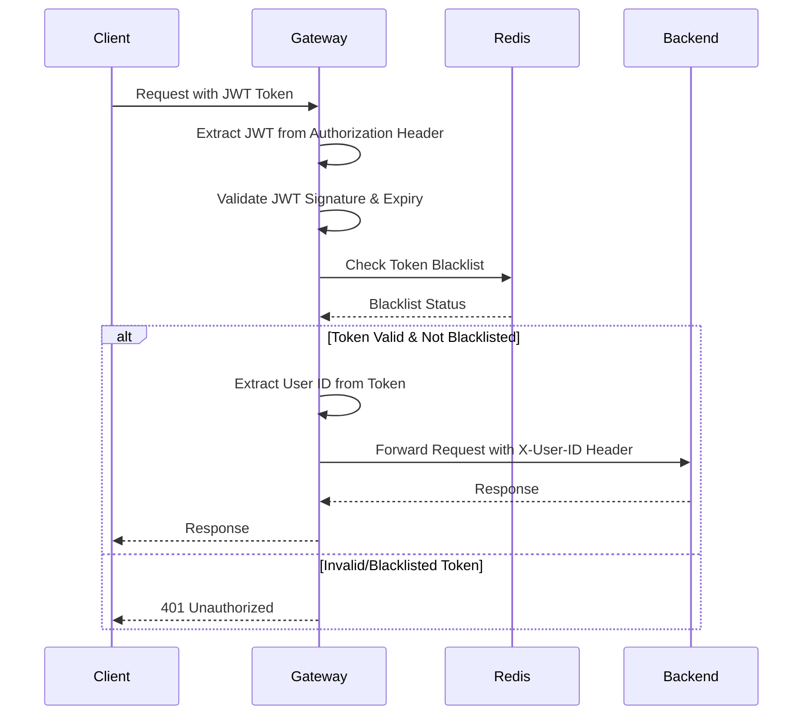

# SSOK Gateway Service

> API Gateway 및 인증/인가를 담당하는 마이크로서비스

## 📋 개요

SSOK Gateway Service는 SSOK 플랫폼의 **API Gateway 및 인증 시스템**을 담당하는 핵심 서비스입니다. 모든 클라이언트 요청의 진입점 역할을 하며, 요청 라우팅, JWT 인증/인가, CORS 처리, 보안 정책 적용을 담당합니다.

### 주요 기능

- **API Gateway**: 클라이언트와 백엔드 서비스 간의 중앙 진입점
- **JWT 인증/인가**: JWT 토큰 검증 및 사용자 인증 처리
- **요청 라우팅**: 요청 경로에 따른 적절한 마이크로서비스로 라우팅
- **보안 정책**: CORS, 화이트리스트, 블랙리스트 토큰 관리
- **사용자 컨텍스트**: 인증된 사용자 정보를 하위 서비스에 전달

## 🏗️ 아키텍처

```
┌─────────────────┐    ┌──────────────────┐    ┌─────────────────┐
│   Client Apps   │    │  Gateway Service │    │ Backend Services│
│                 │    │                  │    │                 │
│ • Web App       │◄──►│ • JWT 인증       │◄──►│ • User Service  │
│ • Mobile App    │    │ • 요청 라우팅    │    │ • Account       │
│ • Admin Panel   │    │ • CORS 처리      │    │ • Transfer      │
│                 │    │ • 보안 정책      │    │ • Notification  │
└─────────────────┘    └──────────────────┘    │ • Bluetooth     │
                                │               └─────────────────┘
                                │
                                ▼
                       ┌──────────────────┐
                       │      Redis       │
                       │                  │
                       │ • JWT 블랙리스트 │
                       │ • 세션 관리      │
                       │ • 캐시 데이터    │
                       └──────────────────┘
```

## 🔧 기술 스택

| 분류 | 기술 |
|------|------|
| **Framework** | Spring Boot 3.4.4, Spring Cloud Gateway |
| **Security** | Spring Security WebFlux, JWT |
| **Reactive** | Spring WebFlux, Project Reactor |
| **Cache** | Redis (블랙리스트, 세션) |
| **Documentation** | OpenAPI 3.0 (라우팅 정보) |
| **Monitoring** | Micrometer, Actuator |
| **Build** | Gradle |

## 📁 프로젝트 구조

```
ssok-gateway-service/
├── src/main/java/kr/ssok/gateway/
│   ├── config/                    # 설정 클래스
│   │   ├── SecurityConfig.java    # Spring Security 설정
│   │   └── RedisConfig.java       # Redis 설정
│   ├── security/                  # 보안 관련
│   │   ├── filter/
│   │   │   └── JwtAuthenticationFilter.java # JWT 인증 필터
│   │   ├── handler/
│   │   │   └── JwtAuthenticationEntryPoint.java # 인증 예외 핸들러
│   │   └── jwt/
│   │       └── JwtVerifier.java   # JWT 토큰 검증
│   └── SsokGatewayApplication.java # 메인 애플리케이션
├── src/main/resources/
│   ├── application.yml            # 라우팅 설정 (ConfigMap)
│   └── logback-spring.xml         # 로깅 설정
├── build.gradle                  # 빌드 설정
└── Dockerfile                    # 컨테이너 이미지 빌드
```

## 🔐 보안 및 인증

### JWT 토큰 검증 플로우



### 인증 필터 동작

1. **요청 수신**: 클라이언트로부터 요청 수신
2. **화이트리스트 확인**: 인증이 필요 없는 경로인지 확인
3. **토큰 추출**: Authorization 헤더에서 JWT 토큰 추출
4. **토큰 검증**: 
   - JWT 서명 유효성 확인
   - 토큰 만료 시간 확인
   - Redis 블랙리스트 확인
5. **사용자 정보 추출**: 토큰에서 사용자 ID 추출
6. **헤더 추가**: `X-User-ID` 헤더를 백엔드 서비스에 전달
7. **요청 전달**: 인증된 요청을 해당 서비스로 라우팅

### 화이트리스트 (인증 불필요 경로)

```java
private static final List<String> WHITELIST = List.of(
    "/api/auth/login",                      // 로그인
    "/api/auth/refresh",                    // 토큰 갱신
    "/api/users/signup",                    // 회원가입
    "/api/users/phone",                     // 휴대폰 인증
    "/api/users/phone/verify",              // 인증 코드 확인
    "/api/users/phone/verify-with-user-check", // 기존 사용자 확인
    "/api/users/pin/existing-user",         // 기존 사용자 PIN 설정
    "/actuator/**",                         // 헬스체크
    "/chaos/**"                             // 카오스 엔지니어링
);
```

## 🚏 라우팅 규칙

### 서비스별 라우팅 매핑

| 경로 패턴 | 대상 서비스 | 설명 |
|-----------|-------------|------|
| `/api/auth/**` | User Service | 인증/인가 관련 API |
| `/api/users/**` | User Service | 사용자 관리 API |
| `/api/profiles/**` | User Service | 프로필 관리 API |
| `/api/terms/**` | User Service | 약관 관리 API |
| `/api/accounts/**` | Account Service | 계좌 관리 API |
| `/api/transfers/**` | Transfer Service | 송금 관리 API |
| `/api/transfer-history/**` | Transfer Service | 거래 내역 API |
| `/api/bluetooth/**` | Bluetooth Service | 블루투스 매칭 API |
| `/api/notification/**` | Notification Service | 알림 발송 API |

### 라우팅 설정 예시 (application.yml)

```yaml
spring:
  cloud:
    gateway:
      routes:
        # User Service 라우팅
        - id: user-service
          uri: http://user-service:8080
          predicates:
            - Path=/api/auth/**, /api/users/**, /api/profiles/**, /api/terms/**
          filters:
            - StripPrefix=0
            
        # Account Service 라우팅  
        - id: account-service
          uri: http://account-service:8080
          predicates:
            - Path=/api/accounts/**
          filters:
            - StripPrefix=0
            
        # Transfer Service 라우팅
        - id: transfer-service
          uri: http://transfer-service:8080
          predicates:
            - Path=/api/transfers/**, /api/transfer-history/**
          filters:
            - StripPrefix=0
            
        # Bluetooth Service 라우팅
        - id: bluetooth-service
          uri: http://bluetooth-service:8080
          predicates:
            - Path=/api/bluetooth/**
          filters:
            - StripPrefix=0
            
        # Notification Service 라우팅
        - id: notification-service
          uri: http://notification-service:8080
          predicates:
            - Path=/api/notification/**
          filters:
            - StripPrefix=0
```

## 🔒 CORS 설정

```java
@Bean
public CorsConfigurationSource corsConfigurationSource() {
    CorsConfiguration configuration = new CorsConfiguration();
    configuration.setAllowedOrigins(Arrays.asList("*"));
    configuration.setAllowedMethods(Arrays.asList("GET", "POST", "PUT", "DELETE", "OPTIONS"));
    configuration.setAllowedHeaders(Arrays.asList("*"));
    configuration.setExposedHeaders(Arrays.asList("Authorization", "Refresh-Token"));
    configuration.setMaxAge(3600L);
    return source;
}
```

## 🚀 빌드 및 실행

### 로컬 개발 환경

1. **사전 요구사항**
   ```bash
   - Java 17+
   - Redis 6+
   - Backend Services Running
   ```

2. **의존성 설치 및 빌드**
   ```bash
   ./gradlew clean build
   ```

3. **환경변수 설정**
   ```yaml
   # application.yml (Kubernetes ConfigMap에서 주입)
   spring:
     data:
       redis:
         host: ${REDIS_HOST}
         port: ${REDIS_PORT}
     cloud:
       gateway:
         routes:
           # 라우팅 설정...
   
   jwt:
     secret: ${JWT_SECRET}
   
   server:
     port: 8080
   
   management:
     endpoints:
       web:
         exposure:
           include: health,prometheus
   ```

4. **애플리케이션 실행**
   ```bash
   java -jar build/libs/ssok-gateway-service-1.0-SNAPSHOT.jar
   ```

### Docker 컨테이너 실행

1. **이미지 빌드**
   ```bash
   docker build -t ssok-gateway-service:latest .
   ```

2. **컨테이너 실행**
   ```bash
   docker run -p 8080:8080 \
     -e REDIS_HOST=redis-host \
     -e JWT_SECRET=your_jwt_secret \
     -e USER_SERVICE_URL=http://user-service:8080 \
     -e ACCOUNT_SERVICE_URL=http://account-service:8080 \
     ssok-gateway-service:latest
   ```

## ⚡ 성능 최적화

### 비동기 처리
- **WebFlux**: Non-blocking I/O 기반 리액티브 처리
- **Reactor**: 백프레셔 및 비동기 스트림 처리
- **Connection Pool**: Redis 연결 풀 관리

### 캐싱 전략
- **Redis**: JWT 블랙리스트 캐싱
- **토큰 검증 결과**: 짧은 시간 동안 검증 결과 캐싱 (옵션)

### 라우팅 최적화
- **Path Matching**: 효율적인 경로 매칭 알고리즘
- **Load Balancing**: 서비스 인스턴스 간 부하 분산
- **Circuit Breaker**: 장애 전파 방지 (추후 추가 예정)

## 📊 모니터링 및 로깅

### 헬스체크
```
GET /actuator/health
```

### 메트릭 수집
```
GET /actuator/prometheus
```

### 로그 구조
```json
{
  "time": "2024-01-01T12:00:00.000+09:00",
  "level": "INFO",
  "logger": "kr.ssok.gateway.security.filter.JwtAuthenticationFilter",
  "thread": "reactor-http-nio-2",
  "message": "Authentication successful for user: 12345",
  "app": "ssok-gateway-service"
}
```

### 커스텀 메트릭
- `gateway.requests.total`: 총 요청 수
- `gateway.requests.duration`: 요청 처리 시간
- `gateway.auth.success.total`: 인증 성공 건수
- `gateway.auth.failure.total`: 인증 실패 건수
- `gateway.routes.{service}.requests`: 서비스별 라우팅 요청 수

## 🚨 예외 처리

### 주요 예외 상황
- **토큰 없음**: Authorization 헤더 누락
- **잘못된 토큰**: JWT 서명 검증 실패
- **만료된 토큰**: 토큰 유효 기간 만료
- **블랙리스트 토큰**: 로그아웃된 토큰 사용 시도
- **서비스 연결 실패**: 백엔드 서비스 장애
- **Redis 연결 실패**: 캐시 서버 장애

### 오류 응답 형식
```json
{
  "isSuccess": false,
  "code": 401,
  "message": "인증에 실패하였습니다."
}
```

### HTTP 상태 코드
- **401 Unauthorized**: 인증 실패
- **403 Forbidden**: 권한 없음
- **404 Not Found**: 라우팅 경로 없음
- **500 Internal Server Error**: 내부 서버 오류
- **502 Bad Gateway**: 백엔드 서비스 오류
- **503 Service Unavailable**: 서비스 일시 중단

## 🔧 설정 관리

### Kubernetes ConfigMap 예시
```yaml
apiVersion: v1
kind: ConfigMap
metadata:
  name: gateway-config
data:
  application.yml: |
    spring:
      cloud:
        gateway:
          routes:
            - id: user-service
              uri: http://user-service:8080
              predicates:
                - Path=/api/auth/**, /api/users/**
              # ... 추가 라우팅 설정
```

### 환경별 설정
- **Development**: 모든 CORS 허용, 상세 로깅
- **Staging**: 프로덕션과 유사한 보안 설정
- **Production**: 엄격한 보안 정책, 최소 로깅

## 🧪 테스트

### 단위 테스트 실행
```bash
./gradlew test
```

### 통합 테스트
```bash
# JWT 토큰 검증 테스트
curl -H "Authorization: Bearer <valid-token>" \
     http://localhost:8080/api/users/info

# 화이트리스트 경로 테스트
curl -X POST http://localhost:8080/api/auth/login \
     -H "Content-Type: application/json" \
     -d '{"userId": 1, "pinCode": "1234"}'
```

### 라우팅 테스트
```bash
# 각 서비스별 라우팅 확인
curl -H "Authorization: Bearer <token>" \
     http://localhost:8080/api/accounts
```

## 🔄 배포 및 운영

### Blue-Green 배포
1. **새 버전 배포**: 새로운 Gateway 인스턴스 시작
2. **헬스체크**: 새 인스턴스 정상 동작 확인
3. **트래픽 전환**: 로드밸런서 트래픽 새 인스턴스로 전환
4. **구 버전 종료**: 기존 인스턴스 종료

### 롤링 업데이트
- **Kubernetes**: Rolling Update 전략 사용
- **Zero Downtime**: 서비스 중단 없는 업데이트
- **Health Check**: 새 Pod 준비 상태 확인

## 📋 TODO / 개선사항

- [ ] **Rate Limiting**: API 호출 빈도 제한
- [ ] **Circuit Breaker**: 장애 전파 방지 패턴 구현
- [ ] **Request/Response Logging**: 상세 요청/응답 로깅
- [ ] **API Versioning**: API 버전 관리 지원
- [ ] **GraphQL Gateway**: GraphQL 엔드포인트 지원
- [ ] **WebSocket Support**: 실시간 통신 지원
- [ ] **Request Transformation**: 요청/응답 변환 기능
- [ ] **Distributed Tracing**: 분산 추적 구현

## 🛡️ 보안 고려사항

### JWT 보안
- **토큰 만료 시간**: 적절한 토큰 유효 기간 설정
- **토큰 블랙리스트**: 로그아웃 시 토큰 무효화
- **토큰 갱신**: Refresh Token을 통한 안전한 토큰 갱신

### 네트워크 보안
- **HTTPS 강제**: TLS 연결 필수
- **CORS 정책**: 명시적인 도메인 허용
- **헤더 보안**: 보안 헤더 추가 (HSTS, CSP 등)

### 모니터링
- **비정상 트래픽 감지**: 과도한 요청 패턴 모니터링
- **인증 실패 추적**: 연속된 인증 실패 감지
- **보안 이벤트 로깅**: 보안 관련 이벤트 상세 로깅

## 🤝 기여 가이드

1. Feature 브랜치 생성
2. 라우팅 규칙 추가/수정
3. 보안 정책 검토
4. 테스트 코드 작성
5. Pull Request 생성
6. 보안 리뷰 및 머지

## 📞 문의

Gateway 서비스 관련 문의사항이 있으시면 이슈를 등록해주세요.

---

> **Note**: 이 서비스는 SSOK 플랫폼의 모든 API 요청이 통과하는 중요한 진입점입니다. 보안과 성능이 매우 중요하므로 변경 시 신중하게 검토해주세요. 다른 서비스들과의 연동 정보는 [메인 README](../README.md)를 참조하세요.