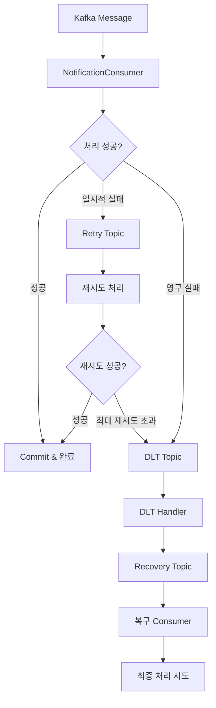

# SSOK Notification Service

> 실시간 알림 발송 및 SMS 인증을 담당하는 마이크로서비스

## 📋 개요

SSOK Notification Service는 SSOK 플랫폼의 **알림 발송 시스템**을 담당하는 핵심 서비스입니다. FCM 푸시 알림, SMS 인증 코드 발송, Kafka 기반 이벤트 처리를 통해 사용자에게 실시간 알림을 제공합니다.

### 주요 기능

- **FCM 푸시 알림**: Firebase Cloud Messaging을 통한 실시간 푸시 알림
- **SMS 인증**: Aligo API를 통한 휴대폰 인증코드 발송
- **Kafka 이벤트 처리**: 비동기 메시지 소비 및 알림 발송
- **토큰 관리**: Redis 기반 FCM 토큰 등록/관리
- **장애 복구**: DLQ 및 Recovery Topic을 통한 안정적인 메시지 처리

## 🏗️ 아키텍처

```
┌─────────────────┐    ┌──────────────────┐    ┌─────────────────┐
│ Transfer Service│    │Notification Svc  │    │ External APIs   │
│                 │    │                  │    │                 │
│ • 송금 완료     │───►│ • Kafka Consumer │◄──►│ • Firebase FCM  │
│ • 이벤트 발행   │    │ • FCM 발송       │    │ • Aligo SMS     │
│                 │    │ • 재시도 처리    │    │                 │
└─────────────────┘    └──────────────────┘    └─────────────────┘
                                │
                                │
                                ▼
┌─────────────────┐    ┌──────────────────┐    ┌─────────────────┐
│     Redis       │    │      Kafka       │    │   Client Apps   │
│                 │    │                  │    │                 │
│ • FCM 토큰      │    │ • Main Topic     │    │ • 푸시 알림 수신│
│ • 토큰 관리     │    │ • Retry Topic    │    │ • SMS 인증      │
│                 │    │ • DLT Topic      │    │                 │
│                 │    │ • Recovery Topic │    │                 │
└─────────────────┘    └──────────────────┘    └─────────────────┘
```

## 🔧 기술 스택

| 분류 | 기술 |
|------|------|
| **Framework** | Spring Boot 3.4.4, Domain-Driven Design |
| **Messaging** | Apache Kafka (Consumer/Producer) |
| **Push Notification** | Firebase Cloud Messaging (FCM) |
| **SMS Service** | Aligo SMS API |
| **Cache** | Redis (FCM 토큰 관리) |
| **Database** | H2 (개발용), JPA |
| **Documentation** | OpenAPI 3.0 (Swagger) |
| **Monitoring** | Micrometer, Actuator |
| **Build** | Gradle |

## 📁 프로젝트 구조

```
ssok-notification-service/
├── src/main/java/kr/ssok/notificationservice/
│   ├── domain/                    # 도메인별 패키지 (DDD)
│   │   ├── fcm/                   # FCM 푸시 알림 도메인
│   │   │   ├── client/
│   │   │   │   └── FirebaseClient.java      # Firebase FCM 클라이언트
│   │   │   ├── config/
│   │   │   │   ├── FirebaseConfig.java      # Firebase 설정
│   │   │   │   ├── KafkaConsumerConfig.java # Kafka Consumer 설정
│   │   │   │   ├── KafkaRetryConfig.java    # 재시도 설정
│   │   │   │   └── RedisConfig.java         # Redis 설정
│   │   │   ├── controller/
│   │   │   │   └── FcmController.java       # FCM API 컨트롤러
│   │   │   ├── dto/
│   │   │   │   └── request/                 # 요청 DTO
│   │   │   ├── enums/
│   │   │   │   ├── BankCode.java           # 은행 코드
│   │   │   │   └── TransferType.java       # 송금 타입
│   │   │   ├── kafka/
│   │   │   │   ├── consumer/
│   │   │   │   │   └── NotificationConsumer.java # Kafka 메시지 소비
│   │   │   │   ├── handler/
│   │   │   │   │   └── KafkaDltHandler.java     # DLQ 처리
│   │   │   │   ├── message/
│   │   │   │   │   └── KafkaNotificationMessageDto.java
│   │   │   │   └── producer/
│   │   │   │       └── NotificationProducer.java
│   │   │   └── service/
│   │   │       ├── FcmService.java          # FCM 토큰 관리
│   │   │       ├── NotificationService.java # 알림 발송 서비스
│   │   │       └── Impl/                    # 서비스 구현체
│   │   ├── aligo/                 # SMS 인증 도메인
│   │   │   ├── controller/
│   │   │   │   └── AligoController.java     # SMS API 컨트롤러
│   │   │   ├── dto/
│   │   │   │   └── AligoVerificationRequestDto.java
│   │   │   └── service/
│   │   │       └── AligoService.java        # SMS 발송 서비스
│   │   └── opensearch/            # 모니터링 도메인
│   │       └── controller/
│   │           └── TestAlertController.java
│   ├── global/                    # 공통 기능
│   │   └── exception/             # 예외 처리
│   │       ├── NotificationException.java
│   │       ├── NotificationPermanentException.java
│   │       ├── NotificationTransientException.java
│   │       ├── NotificationExceptionHandler.java
│   │       └── NotificationResponseStatus.java
│   └── SsokNotificationServiceApplication.java
├── src/main/resources/
│   ├── firebase/                  # Firebase 설정 파일
│   │   └── firebase-adminsdk.json
│   └── logback-spring.xml         # 로깅 설정
├── build.gradle                  # 빌드 설정
└── Dockerfile                    # 컨테이너 이미지 빌드
```

## 🔌 API 엔드포인트

### FCM 푸시 알림 (`/api/notification/fcm`)

| Method | Endpoint | Description | Auth Required |
|--------|----------|-------------|---------------|
| POST | `/register` | FCM 토큰 등록 | ✅ |
| POST | `/send` | 푸시 알림 전송 (내부용) | ❌ |

### SMS 인증 (`/api/notification`)

| Method | Endpoint | Description | Auth Required |
|--------|----------|-------------|---------------|
| POST | `/verify` | SMS 인증코드 발송 | ❌ |

### 모니터링 (`/api/opensearch`)

| Method | Endpoint | Description | Auth Required |
|--------|----------|-------------|---------------|
| POST | `/test-alert` | 테스트 알림 발송 | ❌ |

## 📧 FCM 푸시 알림 시스템

### FCM 토큰 관리

```java
@Service
public class FcmServiceImpl implements FcmService {
    
    @Override
    public void registerFcmToken(Long userId, String token) {
        validateToken(token);
        
        String key = "userfcm:" + userId;
        String existingToken = redisTemplate.opsForValue().get(key);
        
        if (existingToken != null && existingToken.equals(token)) {
            log.debug("동일한 FCM 토큰이 이미 등록되어 있습니다. userId: {}", userId);
            return;
        }
        
        // 새로운 토큰 등록 또는 갱신
        redisTemplate.opsForValue().set(key, token, Duration.ofSeconds(ttlSeconds));
        log.info("FCM 토큰 등록 완료. userId: {}, token: {}", userId, token);
    }
}
```

### Firebase 클라이언트

```java
@Component
public class FirebaseClient {
    
    public void sendNotification(FcmMessageRequestDto request) {
        Message message = Message.builder()
            .setToken(request.getToken())
            .setNotification(Notification.builder()
                .setTitle(request.getTitle())
                .setBody(request.getBody())
                .setImage(request.getImage())
                .build())
            .putAllData(request.getData())
            .build();
        
        try {
            String response = FirebaseMessaging.getInstance().send(message);
            log.info("푸시 알림 전송 성공: {}", response);
        } catch (FirebaseMessagingException e) {
            // 토큰 무효 등 영구 실패
            if (e.getMessage().contains("Requested entity was not found")) {
                throw new NotificationPermanentException(
                    NotificationResponseStatus.FCM_TOKEN_INVALID, e);
            }
            // 일시적 실패 (재시도 가능)
            throw new NotificationTransientException(
                NotificationResponseStatus.FCM_SEND_FAILED_TRANSIENT, e);
        }
    }
}
```

## 📱 Kafka 이벤트 처리

### 메시지 소비 및 처리

```java
@Component
public class NotificationConsumer {
    
    @KafkaListener(
        topics = "${kafka.notification-topic}",
        groupId = "${kafka.group-id}",
        containerFactory = "mainKafkaListenerContainerFactory"
    )
    public void consume(String messageJson, Acknowledgment ack) {
        KafkaNotificationMessageDto message;
        
        try {
            // 1. JSON 파싱
            message = objectMapper.readValue(messageJson, KafkaNotificationMessageDto.class);
        } catch (Exception e) {
            // JSON 파싱 실패 → 영구 실패 (DLT로 즉시 전송)
            throw new NotificationPermanentException(
                NotificationResponseStatus.JSON_PARSE_FAILED, e);
        }
        
        try {
            // 2. FCM 푸시 전송
            String title = String.format("%,d원 입금", message.getAmount());
            String bankName = BankCode.fromIdx(message.getBankCode()).getValue();
            String body = String.format("%s → 내 %s 통장", 
                message.getSenderName(), bankName);
            
            Map<String, String> data = new HashMap<>();
            data.put("screen", "AccountDetail");
            if (message.getAccountId() != null) {
                data.put("accountId", message.getAccountId().toString());
            }
            
            notificationService.sendFcmNotification(
                message.getUserId(), title, body, data);
            
            // 성공 시 커밋
            ack.acknowledge();
            
        } catch (NotificationPermanentException pe) {
            // 영구 실패 → DLT로 즉시 전송
            throw pe;
        } catch (Exception e) {
            // 일시적 실패 → 재시도 대상
            throw new NotificationTransientException(
                NotificationResponseStatus.FCM_SEND_FAILED_PERMANENT, e);
        }
    }
}
```

### Kafka 재시도 및 DLQ 설정



### DLQ 및 복구 처리

```java
@Component
public class KafkaDltHandler {
    
    public void handleDltMessage(
        ConsumerRecord<String, String> record,
        @Header(KafkaHeaders.RECEIVED_TOPIC) String topic,
        @Header(KafkaHeaders.EXCEPTION_MESSAGE) String errorMessage
    ) {
        log.warn("[DLQ 처리] 실패 메시지: '{}', 토픽: '{}', 예외: {}", 
            record.value(), topic, errorMessage);
        
        // Recovery Topic으로 메시지 재전송
        kafkaTemplate.send(RECOVERY_TOPIC, record.value())
            .whenComplete((result, ex) -> {
                if (ex != null) {
                    log.error("[DLQ 처리] 복구 토픽 전송 실패: {}", RECOVERY_TOPIC, ex);
                } else {
                    log.info("[DLQ 처리] 복구 토픽 전송 성공: {}", RECOVERY_TOPIC);
                }
            });
    }
}

// 복구 토픽 메시지 처리
@KafkaListener(
    topics = "${kafka.notification-recover-topic}",
    groupId = "${kafka.recovery-group-id}",
    containerFactory = "recoveryKafkaListenerContainerFactory"
)
public void reconsumeFailedMessages(String messageJson, Acknowledgment ack) {
    try {
        consume(messageJson, ack);
    } catch (Exception e) {
        // 복구 단계에서도 실패 시 무시 (무한루프 방지)
        log.error("복구 단계에서 예외 발생. 무시 처리: {}", messageJson, e);
        ack.acknowledge();
    }
}
```

## 📞 SMS 인증 시스템

### Aligo SMS 발송

```java
@Service
public class AligoService {
    
    public void sendVerificationCode(String phoneNumber, String verificationCode) {
        phoneNumber = formatPhoneNumber(phoneNumber); // +82 → 0으로 변환
        
        RestTemplate restTemplate = new RestTemplate();
        HttpHeaders headers = new HttpHeaders();
        headers.setContentType(MediaType.APPLICATION_FORM_URLENCODED);
        
        MultiValueMap<String, String> map = new LinkedMultiValueMap<>();
        map.add("key", API_KEY);
        map.add("user_id", USER_ID);
        map.add("sender", SENDER);
        map.add("receiver", phoneNumber);
        map.add("msg", "쏙! 인증번호를 안내해드립니다. " + verificationCode);
        
        HttpEntity<MultiValueMap<String, String>> request = 
            new HttpEntity<>(map, headers);
        
        try {
            ResponseEntity<String> response = restTemplate.exchange(
                SMS_API_URL, HttpMethod.POST, request, String.class);
            log.info("SMS 발송 성공: {}", response.getStatusCode());
        } catch (Exception e) {
            log.error("SMS 발송 실패: phoneNumber={}, verificationCode={}", 
                phoneNumber, verificationCode, e);
        }
    }
    
    private String formatPhoneNumber(String phoneNumber) {
        if (phoneNumber.startsWith("+82")) {
            return "0" + phoneNumber.substring(3);
        }
        return phoneNumber;
    }
}
```

## 🚀 빌드 및 실행

### 로컬 개발 환경

1. **사전 요구사항**
   ```bash
   - Java 17+
   - Redis 6+
   - Kafka 2.8+
   - Firebase Admin SDK 설정
   - Aligo SMS API 계정
   ```

2. **Firebase 설정**
   ```bash
   # Firebase Admin SDK 키 파일 설정
   mkdir -p src/main/resources/firebase
   cp firebase-adminsdk.json src/main/resources/firebase/
   ```

3. **의존성 설치 및 빌드**
   ```bash
   ./gradlew clean build
   ```

4. **환경변수 설정**
   ```yaml
   # application.yml (Kubernetes ConfigMap에서 주입)
   spring:
     data:
       redis:
         host: ${REDIS_HOST}
         port: ${REDIS_PORT}
     kafka:
       bootstrap-servers: ${KAFKA_BOOTSTRAP_SERVERS}
   
   # Firebase 설정
   fcm:
     image-url: ${FCM_DEFAULT_IMAGE_URL}
     token-ttl-seconds: 2592000  # 30일
   
   # Aligo SMS 설정
   aligo:
     SMS_API_URL: ${ALIGO_SMS_API_URL}
     API_KEY: ${ALIGO_API_KEY}
     USER_ID: ${ALIGO_USER_ID}
     SENDER: ${ALIGO_SENDER}
   
   # Kafka 토픽 설정
   kafka:
     notification-topic: ${KAFKA_NOTIFICATION_TOPIC}
     notification-recover-topic: ${KAFKA_NOTIFICATION_RECOVER_TOPIC}
     group-id: ${KAFKA_GROUP_ID}
     recovery-group-id: ${KAFKA_RECOVERY_GROUP_ID}
     retry:
       max-attempts: 3
       backoff-ms: 1000
   ```

5. **애플리케이션 실행**
   ```bash
   java -jar build/libs/ssok-notification-service-1.0-SNAPSHOT.jar
   ```

### Docker 컨테이너 실행

1. **이미지 빌드**
   ```bash
   docker build -t ssok-notification-service:latest .
   ```

2. **컨테이너 실행**
   ```bash
   docker run -p 8080:8080 \
     -e REDIS_HOST=redis-host \
     -e KAFKA_BOOTSTRAP_SERVERS=kafka:9092 \
     -e ALIGO_API_KEY=your_aligo_key \
     -v /path/to/firebase-adminsdk.json:/config/firebase-adminsdk.json \
     ssok-notification-service:latest
   ```

## 📊 모니터링 및 로깅

### 헬스체크
```
GET /actuator/health
```

### 메트릭 수집
```
GET /actuator/prometheus
```

### 로그 구조
```json
{
  "time": "2024-01-01T12:00:00.000+09:00",
  "level": "INFO",
  "logger": "kr.ssok.notificationservice.domain.fcm.kafka.consumer.NotificationConsumer",
  "thread": "kafka-consumer-1",
  "message": "FCM 알림 전송 성공 (userId=123, amount=10000)",
  "app": "ssok-notification-service"
}
```

### 커스텀 메트릭
- `notification.fcm.sent.total`: FCM 발송 성공 건수
- `notification.fcm.failed.total`: FCM 발송 실패 건수
- `notification.sms.sent.total`: SMS 발송 성공 건수
- `notification.kafka.consumed.total`: Kafka 메시지 소비 건수
- `notification.kafka.retry.total`: Kafka 재시도 건수
- `notification.kafka.dlt.total`: DLT 처리 건수

## 🔧 설정 관리

### Kafka Consumer 설정

```java
@Configuration
public class KafkaConsumerConfig {
    
    @Bean("mainKafkaListenerContainerFactory")
    public ConcurrentKafkaListenerContainerFactory<String, String> 
        mainKafkaListenerContainerFactory() {
        
        ConcurrentKafkaListenerContainerFactory<String, String> factory = 
            new ConcurrentKafkaListenerContainerFactory<>();
        factory.setConsumerFactory(consumerFactory());
        
        // Manual Acknowledgment 설정
        factory.getContainerProperties().setAckMode(ContainerProperties.AckMode.MANUAL);
        
        // 동시성 설정
        factory.setConcurrency(3);
        
        return factory;
    }
    
    @Bean("recoveryKafkaListenerContainerFactory")
    public ConcurrentKafkaListenerContainerFactory<String, String> 
        recoveryKafkaListenerContainerFactory() {
        
        ConcurrentKafkaListenerContainerFactory<String, String> factory = 
            new ConcurrentKafkaListenerContainerFactory<>();
        factory.setConsumerFactory(recoveryConsumerFactory());
        
        // Recovery 토픽은 재시도 없이 단일 처리
        factory.getContainerProperties().setAckMode(ContainerProperties.AckMode.MANUAL);
        factory.setConcurrency(1);
        
        return factory;
    }
}
```

### Firebase 설정

```java
@Configuration
public class FirebaseConfig {
    
    @PostConstruct
    public void initialize() {
        try {
            ClassPathResource resource = new ClassPathResource("firebase/firebase-adminsdk.json");
            InputStream serviceAccount = resource.getInputStream();
            
            FirebaseOptions options = FirebaseOptions.builder()
                .setCredentials(GoogleCredentials.fromStream(serviceAccount))
                .build();
            
            if (FirebaseApp.getApps().isEmpty()) {
                FirebaseApp.initializeApp(options);
                log.info("Firebase 초기화 완료");
            }
        } catch (IOException e) {
            log.error("Firebase 초기화 실패", e);
            throw new RuntimeException("Firebase 초기화 실패", e);
        }
    }
}
```

## 🧪 테스트

### 단위 테스트 실행
```bash
./gradlew test
```

### FCM 토큰 등록 테스트
```bash
curl -X POST http://localhost:8080/api/notification/fcm/register \
  -H "Authorization: Bearer <token>" \
  -H "X-User-Id: 123" \
  -H "Content-Type: application/json" \
  -d '{
    "token": "fcm_device_token_here"
  }'
```

### SMS 인증코드 발송 테스트
```bash
curl -X POST http://localhost:8080/api/notification/verify \
  -H "Content-Type: application/json" \
  -d '{
    "phoneNumber": "010-1234-5678",
    "verificationCode": "123456"
  }'
```

### Kafka 메시지 발송 테스트
```bash
# Kafka Producer로 테스트 메시지 발송
kafka-console-producer --topic notification-topic --bootstrap-server localhost:9092
> {"userId":123,"accountId":456,"senderName":"홍길동","bankCode":1,"amount":10000,"transferType":"DEPOSIT","timestamp":"2024-01-01T12:00:00"}
```

## 🚨 예외 처리

### 주요 예외 상황
- **FCM 토큰 무효**: 디바이스에서 앱 삭제 또는 토큰 만료
- **Firebase 연결 실패**: Firebase 서비스 장애
- **SMS 발송 실패**: Aligo API 장애 또는 잘못된 전화번호
- **Kafka 연결 실패**: Kafka 클러스터 장애
- **Redis 연결 실패**: Redis 서버 장애

### 예외 분류 및 처리

```java
// 영구 실패 (재시도 불필요)
public class NotificationPermanentException extends RuntimeException {
    // JSON 파싱 실패, FCM 토큰 무효 등
}

// 일시적 실패 (재시도 가능)
public class NotificationTransientException extends RuntimeException {
    // 네트워크 일시 장애, Firebase 서비스 일시 장애 등
}
```

### 응답 형식
```json
{
  "isSuccess": false,
  "code": 4501,
  "message": "FCM 토큰이 필요합니다.",
  "result": null
}
```

## 🔄 장애 복구 시나리오

### Kafka 메시지 처리 장애

1. **일시적 실패**: 최대 3회 재시도 후 DLT로 전송
2. **영구 실패**: 즉시 DLT로 전송
3. **DLT 처리**: Recovery Topic으로 재발행
4. **최종 처리**: Recovery Consumer에서 1회 재시도

### FCM 토큰 무효화 처리

```java
// FCM 토큰 무효 시 Redis에서 제거
@Component
public class FcmTokenCleanupService {
    
    @Scheduled(fixedDelay = 3600000) // 1시간마다
    public void cleanupInvalidTokens() {
        Set<String> keys = redisTemplate.keys("userfcm:*");
        
        for (String key : keys) {
            String token = redisTemplate.opsForValue().get(key);
            if (token != null && isTokenInvalid(token)) {
                redisTemplate.delete(key);
                log.info("무효한 FCM 토큰 제거: {}", key);
            }
        }
    }
}
```

## 📋 TODO / 개선사항

- [ ] **알림 템플릿**: 다양한 알림 유형별 템플릿 관리
- [ ] **알림 설정**: 사용자별 알림 수신 설정 관리
- [ ] **알림 히스토리**: 발송된 알림 이력 저장 및 조회
- [ ] **A/B 테스트**: 알림 메시지 A/B 테스트 기능
- [ ] **Rich Notification**: 이미지, 액션 버튼 포함 알림
- [ ] **웹 푸시**: 브라우저 푸시 알림 지원
- [ ] **이메일 알림**: SMTP를 통한 이메일 발송
- [ ] **알림 스케줄링**: 지연 발송 및 예약 알림
- [ ] **Multi-Language**: 다국어 알림 메시지 지원
- [ ] **알림 분석**: 발송률, 열람률, 클릭률 통계

## 🔐 보안 고려사항

### FCM 토큰 보안

```java
// FCM 토큰 암호화 저장
@Service
public class SecureFcmService {
    
    private final AESUtil aesUtil;
    
    public void registerFcmToken(Long userId, String token) {
        // 토큰 암호화 후 저장
        String encryptedToken = aesUtil.encrypt(token);
        String key = "userfcm:" + userId;
        redisTemplate.opsForValue().set(key, encryptedToken, Duration.ofDays(30));
    }
    
    public String getFcmToken(Long userId) {
        String key = "userfcm:" + userId;
        String encryptedToken = redisTemplate.opsForValue().get(key);
        
        if (encryptedToken != null) {
            return aesUtil.decrypt(encryptedToken);
        }
        return null;
    }
}
```

### API 보안

- **API Key 관리**: Aligo SMS API Key 환경변수 관리
- **Firebase 인증**: Admin SDK 키 파일 보안 저장
- **Rate Limiting**: FCM 토큰 등록 API 호출 제한
- **입력값 검증**: 전화번호, FCM 토큰 형식 검증

## 📈 성능 최적화

### Kafka Consumer 튜닝

```java
// Consumer 성능 설정
@Configuration
public class KafkaPerformanceConfig {
    
    private Map<String, Object> getConsumerProps() {
        Map<String, Object> props = new HashMap<>();
        props.put(ConsumerConfig.BOOTSTRAP_SERVERS_CONFIG, kafkaBootstrapServers);
        props.put(ConsumerConfig.GROUP_ID_CONFIG, groupId);
        
        // 성능 튜닝 옵션
        props.put(ConsumerConfig.FETCH_MIN_BYTES_CONFIG, 1024);        // 최소 fetch 크기
        props.put(ConsumerConfig.FETCH_MAX_WAIT_MS_CONFIG, 500);       // 최대 대기 시간
        props.put(ConsumerConfig.MAX_POLL_RECORDS_CONFIG, 100);        // 한 번에 처리할 레코드 수
        props.put(ConsumerConfig.MAX_POLL_INTERVAL_MS_CONFIG, 300000); // Poll 간격
        
        return props;
    }
}
```

### Redis 연결 최적화

```java
@Configuration
public class RedisOptimizedConfig {
    
    @Bean
    public LettuceConnectionFactory lettuceConnectionFactory() {
        LettuceClientConfiguration clientConfig = LettuceClientConfiguration.builder()
            .commandTimeout(Duration.ofSeconds(2))
            .poolConfig(connectionPoolConfig())
            .build();
            
        return new LettuceConnectionFactory(redisStandaloneConfiguration(), clientConfig);
    }
    
    private GenericObjectPoolConfig<?> connectionPoolConfig() {
        GenericObjectPoolConfig<?> config = new GenericObjectPoolConfig<>();
        config.setMaxTotal(20);
        config.setMaxIdle(10);
        config.setMinIdle(2);
        config.setTestOnBorrow(true);
        config.setTestOnReturn(true);
        return config;
    }
}
```

## 🔍 디버깅 및 문제해결

### 알림 발송 실패 분석

```bash
# FCM 발송 실패 로그 검색
grep "FCM.*실패" /var/log/ssok-notification-service.log | tail -20

# Kafka 메시지 처리 현황
grep "Kafka.*consume" /var/log/ssok-notification-service.log | grep "$(date '+%Y-%m-%d')"

# DLT 처리 현황
grep "DLQ 처리" /var/log/ssok-notification-service.log | tail -10
```

### Redis 토큰 상태 확인

```bash
# Redis 연결 상태 확인
redis-cli ping

# FCM 토큰 개수 확인
redis-cli --scan --pattern "userfcm:*" | wc -l

# 특정 사용자 토큰 확인
redis-cli get "userfcm:123"
```

### Kafka 토픽 상태 확인

```bash
# 토픽 상태 확인
kafka-topics --bootstrap-server localhost:9092 --describe --topic notification-topic

# 컨슈머 그룹 상태 확인
kafka-consumer-groups --bootstrap-server localhost:9092 --describe --group notification-group

# DLT 토픽 메시지 확인
kafka-console-consumer --bootstrap-server localhost:9092 --topic notification-topic-dlt --from-beginning
```

## 🧪 통합 테스트

### TestContainers 활용

```java
@SpringBootTest
@TestPropertySource(properties = {
    "spring.data.redis.host=${embedded.redis.host}",
    "spring.data.redis.port=${embedded.redis.port}",
    "spring.kafka.bootstrap-servers=${embedded.kafka.brokers}"
})
class NotificationServiceIntegrationTest {
    
    @Container
    static RedisContainer redis = new RedisContainer("redis:7.0-alpine")
            .withExposedPorts(6379);
    
    @Container
    static KafkaContainer kafka = new KafkaContainer(DockerImageName.parse("confluentinc/cp-kafka:latest"))
            .withEmbeddedZookeeper();
    
    @Test
    void FCM_토큰_등록_및_알림_발송_테스트() {
        // Given
        Long userId = 123L;
        String fcmToken = "test_fcm_token";
        
        // When
        fcmService.registerFcmToken(userId, fcmToken);
        
        // Kafka 메시지 발송
        String message = """
            {
                "userId": 123,
                "accountId": 456,
                "senderName": "홍길동",
                "bankCode": 1,
                "amount": 10000,
                "transferType": "DEPOSIT"
            }
        """;
        
        kafkaTemplate.send("notification-topic", message);
        
        // Then
        // FCM 발송 로그 확인
        await().atMost(10, SECONDS).untilAsserted(() -> {
            assertThat(fcmSendCount.get()).isEqualTo(1);
        });
    }
}
```

### Mock Firebase 테스트

```java
@ExtendWith(MockitoExtension.class)
class FirebaseClientTest {
    
    @Mock
    private FirebaseMessaging firebaseMessaging;
    
    @InjectMocks
    private FirebaseClient firebaseClient;
    
    @Test
    void FCM_메시지_전송_성공() throws FirebaseMessagingException {
        // Given
        FcmMessageRequestDto request = FcmMessageRequestDto.builder()
            .token("test_token")
            .title("테스트 알림")
            .body("테스트 메시지")
            .build();
        
        when(firebaseMessaging.send(any(Message.class)))
            .thenReturn("projects/test-project/messages/msg-123");
        
        // When & Then
        assertDoesNotThrow(() -> firebaseClient.sendNotification(request));
        verify(firebaseMessaging).send(any(Message.class));
    }
    
    @Test
    void FCM_토큰_무효_시_예외_처리() throws FirebaseMessagingException {
        // Given
        FcmMessageRequestDto request = createTestRequest();
        
        when(firebaseMessaging.send(any(Message.class)))
            .thenThrow(new FirebaseMessagingException("Requested entity was not found"));
        
        // When & Then
        assertThrows(NotificationPermanentException.class, 
            () -> firebaseClient.sendNotification(request));
    }
}
```

## 📊 운영 대시보드

### Grafana 대시보드 쿼리

```promql
# FCM 발송 성공률
rate(notification_fcm_sent_total[5m]) / 
(rate(notification_fcm_sent_total[5m]) + rate(notification_fcm_failed_total[5m])) * 100

# Kafka 메시지 처리 지연 시간
histogram_quantile(0.95, rate(kafka_consumer_fetch_manager_records_lag[5m]))

# Redis 연결 상태
redis_connected_clients

# DLT 처리 건수 (시간당)
increase(notification_kafka_dlt_total[1h])
```

### 알람 설정

```yaml
# Prometheus Alert Rules
groups:
  - name: notification-service
    rules:
      - alert: HighFCMFailureRate
        expr: rate(notification_fcm_failed_total[5m]) > 0.1
        for: 2m
        labels:
          severity: warning
        annotations:
          summary: "FCM 발송 실패율이 높습니다"
          
      - alert: KafkaConsumerLag
        expr: kafka_consumer_lag_sum > 1000
        for: 5m
        labels:
          severity: critical
        annotations:
          summary: "Kafka Consumer 지연이 발생했습니다"
          
      - alert: RedisConnectionDown
        expr: redis_up == 0
        for: 1m
        labels:
          severity: critical
        annotations:
          summary: "Redis 연결이 끊어졌습니다"
```

## 🔄 배포 전략

### Blue-Green 배포

```yaml
# Kubernetes Deployment
apiVersion: apps/v1
kind: Deployment
metadata:
  name: notification-service-blue
spec:
  replicas: 3
  selector:
    matchLabels:
      app: notification-service
      version: blue
  template:
    metadata:
      labels:
        app: notification-service
        version: blue
    spec:
      containers:
      - name: notification-service
        image: ssok-notification-service:v1.2.0
        ports:
        - containerPort: 8080
        env:
        - name: KAFKA_GROUP_ID
          value: "notification-group-blue"
        readinessProbe:
          httpGet:
            path: /actuator/health/readiness
            port: 8080
          initialDelaySeconds: 30
        livenessProbe:
          httpGet:
            path: /actuator/health/liveness
            port: 8080
          initialDelaySeconds: 60
```

### 카나리 배포

```yaml
# 트래픽 분할: 90% 기존 버전, 10% 새 버전
apiVersion: v1
kind: Service
metadata:
  name: notification-service
spec:
  selector:
    app: notification-service
  ports:
  - port: 8080
    targetPort: 8080
---
apiVersion: networking.istio.io/v1alpha3
kind: VirtualService
metadata:
  name: notification-service
spec:
  hosts:
  - notification-service
  http:
  - match:
    - headers:
        canary:
          exact: "true"
    route:
    - destination:
        host: notification-service
        subset: v2
  - route:
    - destination:
        host: notification-service
        subset: v1
      weight: 90
    - destination:
        host: notification-service
        subset: v2
      weight: 10
```

## 🤝 기여 가이드

1. **Feature 브랜치 생성**
   ```bash
   git checkout -b feature/notification-enhancement
   ```

2. **도메인별 개발**
   - FCM 관련: `domain/fcm` 패키지
   - SMS 관련: `domain/aligo` 패키지
   - 공통 기능: `global` 패키지

3. **테스트 작성**
   - 단위 테스트: Mock을 활용한 개별 컴포넌트 테스트
   - 통합 테스트: TestContainers를 활용한 전체 플로우 테스트
   - 성능 테스트: 대용량 메시지 처리 성능 확인

4. **성능 영향도 분석**
   - Kafka Consumer 처리 성능
   - Redis 연결 및 응답 시간
   - FCM API 호출 성능

5. **Pull Request 생성**
   - 변경사항 상세 설명
   - 테스트 결과 첨부
   - 성능 벤치마크 결과

## 📞 문의

Notification Service 관련 문의사항이 있으시면 이슈를 등록해주세요.

### 긴급 문의 (운영 중 장애)
- **FCM 발송 실패**: Firebase 서비스 상태 및 토큰 유효성 확인
- **SMS 발송 실패**: Aligo API 상태 및 계정 잔액 확인
- **Kafka 메시지 적체**: Consumer 처리 성능 및 DLT 상황 확인
- **Redis 연결 장애**: Redis 클러스터 상태 및 네트워크 확인

### 모니터링 대시보드
- **Grafana**: FCM 발송률, Kafka Consumer 지연, Redis 상태
- **Kibana**: 로그 분석 및 에러 패턴 추적
- **Prometheus**: 메트릭 수집 및 알람 설정

---

> **Note**: 이 서비스는 사용자 경험에 직접적인 영향을 미치는 중요한 알림 시스템입니다. 모든 변경사항은 충분한 테스트를 거쳐야 하며, 장애 발생 시 빠른 복구가 가능하도록 모니터링과 알람 체계를 갖추고 있습니다. 다른 서비스들과의 연동 정보는 [메인 README](../README.md)를 참조하세요.