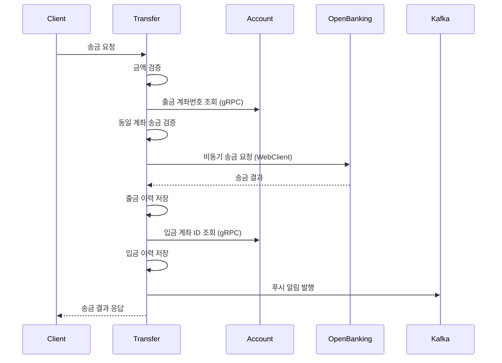
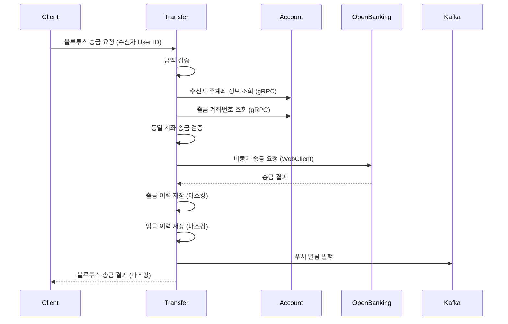

# SSOK Transfer Service

> 송금 처리 및 거래 내역 관리를 담당하는 마이크로서비스

## 📋 개요

SSOK Transfer Service는 SSOK 플랫폼의 **송금 처리 및 거래 내역 관리 시스템**을 담당하는 핵심 서비스입니다. 일반 송금과 블루투스 기반 송금을 처리하며, OpenBanking API와 연동하여 실제 금융 거래를 수행하고, 거래 내역을 관리합니다.

### 주요 기능

- **송금 처리**: 일반 송금 및 블루투스 기반 근거리 송금
- **거래 내역 관리**: 송금 이력 저장, 조회, 분석
- **OpenBanking 연동**: 외부 금융기관과의 실시간 송금 처리
- **비동기 알림**: Kafka를 통한 실시간 푸시 알림 발송
- **gRPC 통신**: Account Service와의 고성능 계좌 정보 조회

## 🏗️ 아키텍처

```
┌─────────────────┐    ┌──────────────────┐    ┌─────────────────┐
│   Client Apps   │    │ Transfer Service │    │ External APIs   │
│                 │    │                  │    │                 │
│ • 일반 송금     │◄──►│ • 송금 처리      │◄──►│ • OpenBanking   │
│ • 블루투스 송금 │    │ • 검증 로직      │    │ • 실시간 송금   │
│ • 거래 내역     │    │ • 내역 관리      │    │                 │
└─────────────────┘    └──────────────────┘    └─────────────────┘
                                │
                                │ gRPC/REST
                                ▼
┌─────────────────┐    ┌──────────────────┐    ┌─────────────────┐
│     MySQL       │    │      Kafka       │    │ Other Services  │
│                 │    │                  │    │                 │
│ • 송금 이력     │    │ • 알림 메시지    │    │ • Account       │
│ • 거래 내역     │    │ • 이벤트 발행    │    │ • User          │
│ • 상대방 정보   │    │                  │    │ • Notification  │
└─────────────────┘    └──────────────────┘    └─────────────────┘
```

## 🔧 기술 스택

| 분류 | 기술 |
|------|------|
| **Framework** | Spring Boot 3.4.4, Spring Data JPA |
| **Database** | MySQL (주 DB), QueryDSL (복잡 쿼리) |
| **Communication** | REST API, gRPC, OpenFeign, WebClient |
| **Async Processing** | CompletableFuture, @Async |
| **Messaging** | Apache Kafka (알림 발송) |
| **External APIs** | OpenBanking API |
| **Documentation** | OpenAPI 3.0 (Swagger) |
| **Monitoring** | Micrometer, Actuator |
| **Build** | Gradle |

## 📁 프로젝트 구조

```
ssok-transfer-service/
├── src/main/java/kr/ssok/transferservice/
│   ├── client/                    # 외부 서비스 클라이언트
│   │   ├── AccountServiceClient.java    # Account Service Feign
│   │   ├── NotificationServiceClient.java # Notification Service
│   │   └── webclient/
│   │       └── OpenBankingApiClient.java # OpenBanking WebClient
│   ├── config/                    # 설정 클래스
│   │   ├── AsyncConfig.java       # 비동기 처리 설정
│   │   ├── KafkaProducerConfig.java # Kafka 설정
│   │   ├── QueryDSLConfig.java    # QueryDSL 설정
│   │   ├── WebClientConfig.java   # WebClient 설정
│   │   └── SwaggerConfig.java     # API 문서 설정
│   ├── controller/                # REST API 컨트롤러
│   │   ├── TransferController.java       # 송금 처리 API
│   │   └── TransferHistoryController.java # 거래 내역 API
│   ├── dto/                       # 데이터 전송 객체
│   │   ├── request/               # 요청 DTO
│   │   │   ├── TransferRequestDto.java
│   │   │   ├── BluetoothTransferRequestDto.java
│   │   │   └── TransferBluetoothRequestDto.java
│   │   └── response/              # 응답 DTO
│   │       ├── TransferResponseDto.java
│   │       ├── TransferHistoryResponseDto.java
│   │       └── TransferCounterpartResponseDto.java
│   ├── entity/                    # JPA 엔티티
│   │   └── TransferHistory.java   # 송금 이력 엔티티
│   ├── enums/                     # 열거형
│   │   ├── TransferType.java      # 입금/출금 구분
│   │   ├── TransferMethod.java    # 일반/블루투스 구분
│   │   ├── BankCode.java          # 은행 코드
│   │   └── CurrencyCode.java      # 통화 코드
│   ├── exception/                 # 예외 처리
│   │   ├── TransferException.java
│   │   ├── TransferExceptionHandler.java
│   │   └── TransferResponseStatus.java
│   ├── grpc/                      # gRPC 클라이언트
│   │   └── client/
│   │       └── AccountServiceClient.java
│   ├── kafka/                     # Kafka 관련
│   │   ├── producer/
│   │   │   └── NotificationProducer.java
│   │   └── message/
│   │       └── KafkaNotificationMessageDto.java
│   ├── repository/                # 데이터 접근 계층
│   │   ├── TransferHistoryRepository.java
│   │   └── custom/                # QueryDSL 커스텀 리포지토리
│   │       └── impl/
│   │           └── TransferHistoryRepositoryImpl.java
│   ├── service/                   # 비즈니스 로직
│   │   ├── TransferService.java
│   │   ├── TransferHistoryService.java
│   │   └── impl/
│   │       ├── TransferServiceImpl.java
│   │       ├── helper/             # 헬퍼 클래스
│   │       │   ├── AccountInfoResolver.java
│   │       │   ├── TransferHistoryRecorder.java
│   │       │   └── TransferNotificationSender.java
│   │       └── validator/
│   │           └── TransferValidator.java
│   └── util/                      # 유틸리티
│       └── MaskingUtils.java      # 민감정보 마스킹
├── src/main/resources/
│   └── logback-spring.xml         # 로깅 설정
├── build.gradle                  # 빌드 설정
└── Dockerfile                    # 컨테이너 이미지 빌드
```

## 🗄️ 데이터베이스 스키마

### TransferHistory 테이블
```sql
CREATE TABLE transfer_history (
    id BIGINT AUTO_INCREMENT PRIMARY KEY,
    account_id BIGINT NOT NULL,                    -- 본인 계좌 ID
    counterpart_account VARCHAR(20) NOT NULL,      -- 상대방 계좌번호
    counterpart_name VARCHAR(50) NOT NULL,         -- 상대방 이름
    counterpart_bank_code VARCHAR(20) NOT NULL,    -- 상대방 은행코드
    transfer_type VARCHAR(20) NOT NULL,            -- 입금/출금 (DEPOSIT/WITHDRAWAL)
    transfer_money BIGINT NOT NULL,                -- 송금 금액
    currency_code VARCHAR(10) NOT NULL,            -- 통화 코드 (KRW/USD)
    transfer_method VARCHAR(20) NOT NULL,          -- 송금 방법 (GENERAL/BLUETOOTH)
    created_at TIMESTAMP NOT NULL,                 -- 거래 시간
    
    INDEX idx_account_id (account_id),
    INDEX idx_created_at (created_at),
    INDEX idx_transfer_type (transfer_type),
    INDEX idx_counterpart_account (counterpart_account)
);
```

### 지원하는 열거형

```java
// 송금 유형
public enum TransferType {
    DEPOSIT,      // 입금
    WITHDRAWAL    // 출금
}

// 송금 방법
public enum TransferMethod {
    GENERAL,      // 일반 송금
    BLUETOOTH     // 블루투스 송금
}

// 통화 코드
public enum CurrencyCode {
    KRW,          // 한국원
    USD           // 미국달러
}
```

## 🔌 API 엔드포인트

### 송금 처리 (`/api/transfers/openbank`)

| Method | Endpoint | Description | Auth Required |
|--------|----------|-------------|---------------|
| POST | `/` | 일반 송금 | ✅ |
| POST | `/bluetooth` | 블루투스 송금 | ✅ |

### 거래 내역 (`/api/transfers`)

| Method | Endpoint | Description | Auth Required |
|--------|----------|-------------|---------------|
| GET | `/histories?accountId={id}` | 특정 계좌 거래 내역 (3개월) | ✅ |
| GET | `/counterparts` | 최근 송금 상대 목록 | ✅ |
| GET | `/history` | 최근 송금 이력 3건 | ✅ |

## 💼 주요 비즈니스 로직

### 일반 송금 처리 플로우



### 블루투스 송금 처리 플로우



### 송금 검증 로직

```java
@Component
public class TransferValidator {
    // 송금 금액 검증
    public void validateTransferAmount(Long amount) {
        if (amount == null || amount <= 0) {
            throw new TransferException(TransferResponseStatus.INVALID_TRANSFER_AMOUNT);
        }
    }
    
    // 동일 계좌 송금 방지
    public void validateSameAccount(String sendAccount, String recvAccount) {
        if (sendAccount.equals(recvAccount)) {
            throw new TransferException(TransferResponseStatus.SAME_ACCOUNT_TRANSFER_NOT_ALLOWED);
        }
    }
}
```

## ⚡ 비동기 처리 및 성능 최적화

### 비동기 송금 처리

```java
@Async("customExecutorWebClient")
@Transactional
public CompletableFuture<TransferResponseDto> transfer(Long userId, TransferRequestDto dto, TransferMethod transferMethod) {
    // 1. 검증 및 계좌 정보 조회 (동기)
    validator.validateTransferAmount(dto.getAmount());
    String sendAccountNumber = accountResolver.findSendAccountNumber(dto.getSendAccountId(), userId);
    
    // 2. OpenBanking 비동기 호출
    return openBankingWebClient
        .sendTransferRequestAsync(obReq)
        .thenApply(response -> {
            // 3. 응답 처리 및 이력 저장
            if (!response.isSuccess()) {
                throw new TransferException(TransferResponseStatus.REMITTANCE_FAILED);
            }
            
            // 4. 거래 이력 저장 및 알림 발송
            transferHistoryRecorder.saveTransferHistory(/* ... */);
            saveDepositHistoryIfReceiverExists(sendAccountNumber, dto, transferMethod);
            
            return buildTransferResponse(dto);
        });
}
```

### WebClient 설정

```java
@Configuration
public class WebClientConfig {
    @Bean
    public WebClient openBankingWebClient() {
        return WebClient.builder()
            .baseUrl("${external.openbanking-service.base-url}")
            .defaultHeader(HttpHeaders.CONTENT_TYPE, MediaType.APPLICATION_JSON_VALUE)
            .codecs(configurer -> configurer.defaultCodecs().maxInMemorySize(1 * 1024 * 1024))
            .build();
    }
}
```

### QueryDSL 복잡 쿼리

```java
@Repository
public class TransferHistoryRepositoryImpl implements TransferHistoryRepositoryCustom {
    
    public List<TransferCounterpartResponseDto> findRecentCounterparts(List<Long> accountIds) {
        return queryFactory
            .select(Projections.constructor(
                TransferCounterpartResponseDto.class,
                history.counterpartName,
                history.counterpartAccount,
                history.counterpartBankCode,
                history.createdAt.max()
            ))
            .from(history)
            .where(
                history.accountId.in(accountIds),
                history.transferType.eq(TransferType.WITHDRAWAL),
                history.transferMethod.eq(TransferMethod.GENERAL)
            )
            .groupBy(history.counterpartAccount, history.counterpartName, history.counterpartBankCode)
            .orderBy(history.createdAt.max().desc())
            .limit(50)
            .fetch();
    }
}
```

## 📡 Kafka 메시징

### 알림 메시지 발행

```java
@Component
public class NotificationProducer {
    public void send(KafkaNotificationMessageDto message) {
        try {
            String jsonMessage = objectMapper.writeValueAsString(message);
            kafkaTemplate.send(topic, jsonMessage);
            log.info("Kafka 알림 메시지 발행: {}", jsonMessage);
        } catch (JsonProcessingException e) {
            log.error("Kafka 메시지 직렬화 실패", e);
        }
    }
}
```

### 알림 메시지 구조

```java
@Builder
public class KafkaNotificationMessageDto {
    private Long userId;                // 수신자 사용자 ID
    private Long accountId;             // 수신자 계좌 ID
    private String senderName;          // 송금자 이름
    private Integer bankCode;           // 은행 코드
    private Long amount;                // 송금 금액
    private TransferType transferType;  // 송금 유형 (입금/출금)
    private LocalDateTime timestamp;    // 발송 시간
}
```

## 🔍 gRPC 서비스 통신

### Account Service 연동

```java
@Component
public class AccountServiceClient implements AccountService {
    
    // 계좌번호로 계좌 ID 조회
    public AccountIdResponseDto getAccountId(String accountNumber) {
        AccountNumberRequest request = AccountNumberRequest.newBuilder()
            .setAccountNumber(accountNumber)
            .build();
        
        AccountIdResponse response = 
            accountServiceBlockingStub.getAccountIdByAccountNumber(request);
        
        return AccountIdResponseDto.builder()
            .accountId(response.getAccountId())
            .userId(response.getUserId())
            .build();
    }
    
    // 주계좌 정보 조회
    public PrimaryAccountResponseDto getPrimaryAccountInfo(String userId) {
        UserIdRequest request = UserIdRequest.newBuilder()
            .setUserId(userId)
            .build();
        
        PrimaryAccountInfoResponse response = 
            accountServiceBlockingStub.getPrimaryAccountInfo(request);
        
        return PrimaryAccountResponseDto.builder()
            .accountId(response.getAccountId())
            .accountNumber(response.getAccountNumber())
            .bankCode(response.getBankCode())
            .username(response.getUsername())
            .build();
    }
}
```

## 🛡️ 보안 및 프라이버시

### 민감정보 마스킹

```java
public class MaskingUtils {
    // 계좌번호 마스킹 (뒤 4자리)
    public static String maskAccountNumber(String accountNumber) {
        if (accountNumber == null || accountNumber.length() < 4) {
            return accountNumber;
        }
        return accountNumber.substring(0, accountNumber.length() - 4) + "****";
    }
    
    // 사용자명 마스킹 (두 번째 글자)
    public static String maskUsername(String username) {
        if (username == null || username.length() < 2) {
            return username;
        }
        return username.charAt(0) + "*" + username.substring(2);
    }
}
```

### 블루투스 송금 개인정보 보호

- **계좌번호 마스킹**: 거래 이력에 마스킹된 계좌번호 저장
- **이름 마스킹**: 거래 상대방 이름 일부 마스킹
- **응답 마스킹**: 클라이언트 응답에도 마스킹 적용

## 🚀 빌드 및 실행

### 로컬 개발 환경

1. **사전 요구사항**
   ```bash
   - Java 17+
   - MySQL 8.0+
   - Kafka 2.8+
   - Account Service Running
   - OpenBanking API Server
   ```

2. **의존성 설치 및 빌드**
   ```bash
   ./gradlew clean build
   ```

3. **환경변수 설정**
   ```yaml
   # application.yml (Kubernetes ConfigMap에서 주입)
   spring:
     datasource:
       url: jdbc:mysql://localhost:3306/ssok_transfer
       username: ${DB_USERNAME}
       password: ${DB_PASSWORD}
     kafka:
       bootstrap-servers: ${KAFKA_BOOTSTRAP_SERVERS}
   
   external:
     openbanking-service:
       base-url: ${OPENBANKING_BASE_URL}
       api-key: ${OPENBANKING_API_KEY}
     account-service:
       url: ${ACCOUNT_SERVICE_URL}
   
   grpc:
     client:
       account-service:
         address: ${ACCOUNT_SERVICE_GRPC_ADDRESS}
   
   kafka:
     notification-topic: ${KAFKA_NOTIFICATION_TOPIC}
   ```

4. **애플리케이션 실행**
   ```bash
   java -jar build/libs/ssok-transfer-service-1.0-SNAPSHOT.jar
   ```

### Docker 컨테이너 실행

1. **이미지 빌드**
   ```bash
   docker build -t ssok-transfer-service:latest .
   ```

2. **컨테이너 실행**
   ```bash
   docker run -p 8080:8080 \
     -e DB_USERNAME=your_db_user \
     -e DB_PASSWORD=your_db_password \
     -e KAFKA_BOOTSTRAP_SERVERS=kafka:9092 \
     -e OPENBANKING_API_KEY=your_api_key \
     ssok-transfer-service:latest
   ```

## 📊 모니터링 및 로깅

### 헬스체크
```
GET /actuator/health
```

### 메트릭 수집
```
GET /actuator/prometheus
```

### 성능 로그 구조
```
[TPS-PROFILE] 전체=245ms | 검증=5ms | 계좌조회=15ms | 동일계좌검증=2ms | 
오픈뱅킹호출(전)=8ms | 오픈뱅킹호출(소요)=180ms | 출금저장=20ms | 입금저장+알림=15ms
```

### 커스텀 메트릭
- `transfer.requests.total`: 총 송금 요청 수
- `transfer.success.total`: 송금 성공 건수
- `transfer.failure.total`: 송금 실패 건수
- `transfer.duration`: 송금 처리 시간
- `transfer.amount.total`: 총 송금 금액
- `openbanking.api.duration`: OpenBanking API 응답 시간

## 🧪 테스트

### 단위 테스트 실행
```bash
./gradlew test
```

### API 테스트 (Swagger UI)
```
http://localhost:8080/swagger-ui/index.html
```

### 송금 테스트 예시
```bash
# 일반 송금 테스트
curl -X POST http://localhost:8080/api/transfers/openbank \
  -H "Authorization: Bearer <token>" \
  -H "X-User-Id: 123" \
  -H "Content-Type: application/json" \
  -d '{
    "sendAccountId": 1,
    "sendBankCode": 1,
    "sendName": "홍길동",
    "recvAccountNumber": "1234567890",
    "recvBankCode": 2,
    "recvName": "김철수",
    "amount": 10000
  }'

# 블루투스 송금 테스트
curl -X POST http://localhost:8080/api/transfers/openbank/bluetooth \
  -H "Authorization: Bearer <token>" \
  -H "X-User-Id: 123" \
  -H "Content-Type: application/json" \
  -d '{
    "sendAccountId": 1,
    "sendBankCode": 1,
    "sendName": "홍길동",
    "recvUserId": 456,
    "amount": 5000
  }'
```

## 🚨 예외 처리

### 주요 예외 상황
- **송금 금액 오류**: 0원 이하 송금 시도
- **동일 계좌 송금**: 출금/입금 계좌가 동일한 경우
- **계좌 조회 실패**: 존재하지 않는 계좌
- **잔액 부족**: 출금 가능 금액 초과
- **OpenBanking API 오류**: 외부 API 호출 실패
- **네트워크 타임아웃**: 외부 서비스 응답 지연

### 응답 형식
```json
{
  "isSuccess": false,
  "code": 4304,
  "message": "송금 금액은 0보다 커야 합니다.",
  "result": null
}
```

### OpenBanking 오류 매핑
```java
// OpenBanking API 오류 코드를 내부 예외로 매핑
switch (openBankingErrorCode) {
    case "ACCOUNT_NOT_FOUND":
        return TransferResponseStatus.ACCOUNT_NOT_FOUND;
    case "INSUFFICIENT_BALANCE":
        return TransferResponseStatus.INSUFFICIENT_BALANCE;
    case "TRANSFER_LIMIT_EXCEEDED":
        return TransferResponseStatus.TRANSFER_LIMIT_EXCEEDED;
    default:
        return TransferResponseStatus.TRANSFER_UNKNOWN_ERROR;
}
```

## 📋 TODO / 개선사항

- [ ] **거래 제한**: 일일/월간 송금 한도 설정
- [ ] **사기 방지**: 의심 거래 탐지 알고리즘
- [ ] **거래 취소**: 송금 취소 및 환불 기능
- [ ] **수수료 계산**: 송금 수수료 자동 계산
- [ ] **통계 대시보드**: 송금 패턴 분석 및 시각화
- [ ] **예약 송금**: 지정 시간 송금 기능
- [ ] **반복 송금**: 정기 송금 스케줄링
- [ ] **Multi-Currency**: 해외 송금 지원
- [ ] **Batch Processing**: 대량 송금 일괄 처리
- [ ] **Real-time Dashboard**: 실시간 송금 현황 모니터링

## 🔄 트랜잭션 관리

### 분산 트랜잭션

송금 처리는 여러 시스템에 걸친 분산 트랜잭션입니다:

1. **로컬 트랜잭션**: Transfer Service 내 거래 이력 저장
2. **외부 API 호출**: OpenBanking API 송금 요청
3. **이벤트 발행**: Kafka 알림 메시지 발송

### Saga 패턴 적용

```java
@Service
public class TransferSagaOrchestrator {
    
    public CompletableFuture<TransferResponseDto> executeTransfer(TransferRequestDto request) {
        return CompletableFuture
            .supplyAsync(() -> validateTransfer(request))      // 1. 검증
            .thenCompose(this::callOpenBanking)                // 2. 외부 API 호출
            .thenCompose(this::saveTransferHistory)            // 3. 이력 저장
            .thenCompose(this::sendNotification)               // 4. 알림 발송
            .exceptionally(this::handleFailure);              // 보상 트랜잭션
    }
    
    private CompletableFuture<Void> handleFailure(Throwable ex) {
        // 실패 시 보상 로직 (rollback, 알림 등)
        log.error("송금 처리 실패: {}", ex.getMessage());
        return compensationService.rollback();
    }
}
```

## 🔧 설정 관리

### Async 설정

```java
@Configuration
@EnableAsync
public class AsyncConfig {
    
    @Bean(name = "customExecutorWebClient")
    public TaskExecutor customExecutorWebClient() {
        ThreadPoolTaskExecutor executor = new ThreadPoolTaskExecutor();
        executor.setCorePoolSize(10);
        executor.setMaxPoolSize(50);
        executor.setQueueCapacity(100);
        executor.setThreadNamePrefix("Transfer-Async-");
        executor.setRejectedExecutionHandler(new ThreadPoolExecutor.CallerRunsPolicy());
        executor.initialize();
        return executor;
    }
}
```

### Kafka 설정

```java
@Configuration
public class KafkaProducerConfig {
    
    @Bean
    public ProducerFactory<String, String> producerFactory() {
        Map<String, Object> props = new HashMap<>();
        props.put(ProducerConfig.BOOTSTRAP_SERVERS_CONFIG, kafkaBootstrapServers);
        props.put(ProducerConfig.KEY_SERIALIZER_CLASS_CONFIG, StringSerializer.class);
        props.put(ProducerConfig.VALUE_SERIALIZER_CLASS_CONFIG, StringSerializer.class);
        props.put(ProducerConfig.ACKS_CONFIG, "all");
        props.put(ProducerConfig.RETRIES_CONFIG, 3);
        props.put(ProducerConfig.ENABLE_IDEMPOTENCE_CONFIG, true);
        return new DefaultKafkaProducerFactory<>(props);
    }
}
```

## 📈 성능 튜닝

### 데이터베이스 최적화

```sql
-- 인덱스 최적화
CREATE INDEX idx_transfer_history_composite 
ON transfer_history (account_id, transfer_type, created_at DESC);

-- 파티셔닝 (월별)
ALTER TABLE transfer_history 
PARTITION BY RANGE (YEAR(created_at) * 100 + MONTH(created_at)) (
    PARTITION p202401 VALUES LESS THAN (202402),
    PARTITION p202402 VALUES LESS THAN (202403),
    -- ...
);
```

### 캐싱 전략

```java
@Service
public class TransferHistoryService {
    
    @Cacheable(value = "transferCounterparts", key = "#userId")
    public List<TransferCounterpartResponseDto> getRecentCounterparts(Long userId) {
        List<Long> accountIds = accountServiceClient.getAccountIdsByUserId(userId.toString());
        return transferHistoryRepository.findRecentCounterparts(accountIds);
    }
    
    @CacheEvict(value = "transferCounterparts", key = "#userId")
    public void invalidateCounterpartsCache(Long userId) {
        // 송금 완료 시 캐시 무효화
    }
}
```

## 🔐 보안 강화

### API Rate Limiting

```java
@Component
public class TransferRateLimiter {
    
    private final RedisTemplate<String, String> redisTemplate;
    
    public boolean isAllowed(Long userId, TransferMethod method) {
        String key = String.format("transfer:rate:%d:%s", userId, method);
        String count = redisTemplate.opsForValue().get(key);
        
        if (count == null) {
            redisTemplate.opsForValue().set(key, "1", Duration.ofMinutes(1));
            return true;
        }
        
        int currentCount = Integer.parseInt(count);
        if (currentCount >= getMaxTransfersPerMinute(method)) {
            return false;
        }
        
        redisTemplate.opsForValue().increment(key);
        return true;
    }
}
```

### 거래 패턴 분석

```java
@Component
public class FraudDetectionService {
    
    public boolean isSuspiciousTransaction(TransferRequestDto request, Long userId) {
        // 1. 금액 패턴 분석
        if (isUnusualAmount(request.getAmount(), userId)) {
            return true;
        }
        
        // 2. 시간 패턴 분석
        if (isUnusualTime(LocalDateTime.now(), userId)) {
            return true;
        }
        
        // 3. 빈도 분석
        if (isHighFrequency(userId)) {
            return true;
        }
        
        return false;
    }
}
```

## 🧪 통합 테스트

### TestContainers 활용

```java
@SpringBootTest
@TestPropertySource(properties = {
    "spring.datasource.url=jdbc:tc:mysql:8.0:///testdb",
    "spring.kafka.bootstrap-servers=${embedded.kafka.brokers}"
})
class TransferServiceIntegrationTest {
    
    @Container
    static MySQLContainer<?> mysql = new MySQLContainer<>("mysql:8.0")
            .withDatabaseName("testdb")
            .withUsername("test")
            .withPassword("test");
    
    @Container
    static KafkaContainer kafka = new KafkaContainer(DockerImageName.parse("confluentinc/cp-kafka:latest"));
    
    @Test
    void 일반송금_성공_테스트() {
        // Given
        TransferRequestDto request = createTransferRequest();
        
        // When
        CompletableFuture<TransferResponseDto> result = transferService.transfer(1L, request, TransferMethod.GENERAL);
        
        // Then
        assertThat(result.join().getAmount()).isEqualTo(10000L);
    }
}
```

### Mock 서버 테스트

```java
@ExtendWith(MockitoExtension.class)
class OpenBankingClientTest {
    
    @Mock
    private WebClient webClient;
    
    @Test
    void OpenBanking_송금요청_성공() {
        // Given
        OpenBankingTransferRequestDto request = createOpenBankingRequest();
        OpenBankingResponse mockResponse = createSuccessResponse();
        
        when(webClient.post().uri(any()).bodyValue(any()).retrieve().bodyToMono(any()))
            .thenReturn(Mono.just(mockResponse));
        
        // When
        CompletableFuture<OpenBankingResponse> result = openBankingClient.sendTransferRequestAsync(request);
        
        // Then
        assertThat(result.join().isSuccess()).isTrue();
    }
}
```

## 🔍 디버깅 및 문제해결

### 송금 실패 분석

```bash
# 송금 실패 로그 검색
grep "송금 실패" /var/log/ssok-transfer-service.log | tail -20

# 특정 사용자 송금 이력
grep "userId:123" /var/log/ssok-transfer-service.log | grep "TRANSFER"

# OpenBanking API 응답 시간 분석
grep "오픈뱅킹호출(소요)" /var/log/ssok-transfer-service.log | awk '{print $5}' | sort -n
```

### 성능 이슈 진단

```sql
-- 느린 쿼리 분석
SELECT * FROM performance_schema.events_statements_summary_by_digest 
WHERE DIGEST_TEXT LIKE '%transfer_history%' 
ORDER BY AVG_TIMER_WAIT DESC LIMIT 10;

-- 최근 송금 현황
SELECT 
    DATE(created_at) as date,
    transfer_method,
    COUNT(*) as count,
    SUM(transfer_money) as total_amount
FROM transfer_history 
WHERE created_at >= DATE_SUB(NOW(), INTERVAL 7 DAY)
GROUP BY DATE(created_at), transfer_method
ORDER BY date DESC;
```

## 🤝 기여 가이드

1. **Feature 브랜치 생성**
   ```bash
   git checkout -b feature/new-transfer-feature
   ```

2. **코드 작성 및 테스트**
   - 단위 테스트 작성 필수
   - 통합 테스트 추가 권장
   - OpenBanking API Mock 테스트

3. **성능 테스트**
   - 동시 송금 요청 처리 확인
   - 메모리 사용량 모니터링
   - 응답 시간 측정

4. **Pull Request 생성**
   - 변경사항 상세 설명
   - 테스트 결과 첨부
   - 성능 영향도 분석

5. **코드 리뷰 및 머지**
   - 보안 검토 필수
   - 성능 영향도 검토
   - 장애 시나리오 검토

## 📞 문의

Transfer Service 관련 문의사항이 있으시면 이슈를 등록해주세요.

### 긴급 문의 (운영 중 장애)
- **송금 실패**: OpenBanking API 상태 확인 필요
- **성능 저하**: 데이터베이스 연결 상태 및 쿼리 성능 확인
- **알림 지연**: Kafka 클러스터 상태 확인

---

> **Note**: 이 서비스는 실제 금융 거래를 처리하는 핵심 서비스입니다. 모든 변경사항은 충분한 테스트를 거친 후 적용해야 하며, 장애 발생 시 즉시 대응할 수 있는 모니터링 체계를 갖추고 있습니다. 다른 서비스들과의 연동 정보는 [메인 README](../README.md)를 참조하세요.